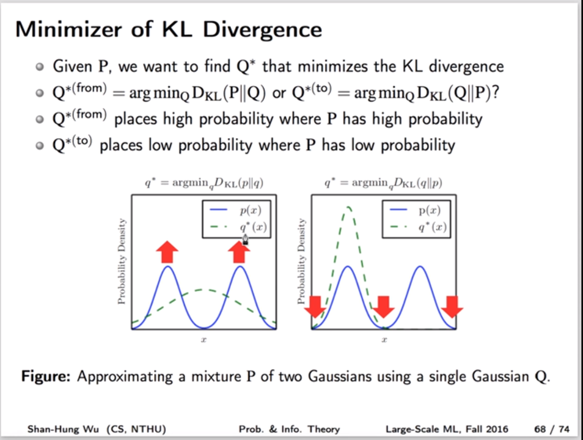

# Mathematical Modeling🌀🔥⚡

```txt
Created Date: Thursday, September 5th 2019, 10:57:07 am
Author: ZeFeng Zhu
```

## Progress

> 👶 👦 🧒 👨 👴

|   |Mathematical Modeling|Pattern Recognition|Machine Learning|
|---|---|---|---|
|Basic Knowledge|👦|👦|👶|
|Introduction|👦|👦|👶|
|Practice|👶|👶|👶|
|Pro|👶|👶|👶|

## Some Note

> Noted that following note may be error-prone

### Entropy (Measuring Information)

#### Definition of Shannon's Entropy

* 信息中有
  * 有意义信息(非冗余)
  * 无意义信息
  * 冗余信息
* Bit作为信息量(Information)的衡量方式
  * Bit = 0 or 1 (是或不是, 天然等概率)
  * Bit = Uncertainty divided by 2
* 对于Bit计算方法的两种直观理解方式
  * N种情况(state) -> log计算 -> 得到信息量 $\log_{2}^{N}$
    * 可以这样理解，N种情况等可能(Uncertainty divided by N, N is uncertainty reduction factor)，把所有情况赋予二进制编码, 为了完整描述每一情况，需要的二进制位数即是传递该情况所需的信息量
    * 在此种理解方式下
      * N只能为正整数?
      * 只适用于各个情况(state)<可能性/概率>均等的情况?
  * 直接log化概率 (MORE GENERAL) $-log_2^{p}$
    * 仔细思考会知道，$\text{num of yes/no questions}=\log_{2}(\text{情况数目})=\log_{2}(1/p)$
    * 不过当非等概率(且底数非2的指数倍)以及概率倒数非整数的情况下，该定义仍适用的理由还要思考清楚
* 从log计算来看, 对于概率越大的事件, 其对应信息bit越低; state越少对应信息bit也越低。反之越大。意味着越确定的事情bit越低(信息量越少)，反之越大。
* Measure the average amount of information
  * 相当于数学期望 (average number of yes/no questions we need to ask to get the correct answer, 参见video2, 二叉树的应用)
  * $-\sum_{i}p_{i}log_{2}(p_{i})$
  * That's it, the formula calculates the entropy, which measures the uncertainty.
  * $H(\text{p}) = -\sum_{i}p_{i}log_{2}(p_{i})$, $\text{p}$为概率分布
    * it tells how unpredictable the probability distribution is.
    * 且在这里的信息都是有意义信息，无意义或冗余信息可以看作是为传递有意义信息而产生的成本，传递的信息的集合称为消息(message)

|Index|Weather|Possibility|Code|Information|Message|
|---|---|---|---|---|---|
|0  |🌞 |0.125|000|3 bits|3 bits|
|1  |⛅ |0.125|001|3 bits|3 bits|
|2  |☁ |0.125|010|3 bits|3 bits|
|3  |🌨 |0.125|011|3 bits|3 bits|
|4  |🌧 |0.125|100|3 bits|3 bits|
|5  |🌩 |0.125|101|3 bits|3 bits|
|6  |🌪 |0.125|110|3 bits|3 bits|
|7  |🌫 |0.125|111|3 bits|3 bits|

表1

```viz
graph tree1 {
    edge [color="0.700 0.200 1.000"];
    node [style=filled, color="0.650 0.200 1.000"];
    overlap=false;
    ABCD--AB[label="1/2"];
    ABCD--CD[label="1/2"];
    AB--A[label="1/4"];
    AB--B[label="1/4"];
    CD--C[label="1/4"];
    CD--D[label="1/4"];
}
```

图1 (等概率，层层二分)

```viz
graph tree2 {
    edge [color="0.700 0.200 1.000"];
    node [style=filled, color="0.650 0.200 1.000"];
    ABCD--A[label="1/2"];
    ABCD--BCD[label="1/2"];
    BCD--D[label="1/4"];
    BCD--BC[label="1/4"];
    BC--B[label="1/8"];
    BC--C[label="1/8"];
}
```

图2 (非等概率，但可层层二分)

```viz
graph tree3 {
    edge [color="0.700 0.200 1.000"];
    node [style=filled, color="0.650 0.200 1.000"];
    A[label="3/5"];
    B[label="1/5"];
    C[label="1/10"];
    D[label="1/10"];
}
```

图3 (非等概率，不可二分?)

* Cross-Entropy
  * 可以理解为传递消息(message)所需的期望信息量?
  * 表2中 $\text{Entropy} = 2.23 \,\text{bits},\, \text{Cross-Entropy} = 3\,\text{bits}$
  * 表3中 $\text{Cross-Entropy} = 2.42\,\text{bits}$
  * $H(\text{p, q})=-\sum_{i}p_{i}\log_{2}(q_{i})$, $\text{p}$为true概率分布, $\text{q}$为predicted概率分布
  * 提及的二表的Message列即为predicted distribution，由Code列决定
  * predicted possibility加和不一定为1
  * 如果预测良好(两distribution相等)，则Cross-Entropy与Entropy计算数值相等; 如果predicted distribution与true distribution存在差异，则Cross-Entropy将会比Entropy大(在message进行合理编码的情况下?)
    * $\text{Cross-Entropy}-\text{Entropy} \Rightarrow \text{Relative Entropy} \Rightarrow \text{Kullback-Leibler divergence}$
    * $\text{Cross-Entropy} = \text{Entropy} + \text{K-L divergence}$
  * K-L divergence:
    * $D_{KL}(\text{p}||\text{q})=H(\text{p, q})-H(\text{p})=-\sum_{i}p_{i}\log_{2}(q_{i})+\sum_{i}p_{i}\log_{2}(p_{i})=\sum_{i}p_{i}[log_{2}(p_{i})-log_2(q_{i})]=\sum_{i}p_{i}\log_{2}^{\cfrac{p_{i}}{q_{i}}}$
    * 另一种写法: $D_{KL}(P||Q)=E_{x\sim P}\left[\log \cfrac{P(x)}{Q(x)}\right]$
    * 特殊情形: $D(p||q)=p\log^{\cfrac{p}{q}}+(1-p)\log^{\cfrac{1-p}{1-q}}$
    * Saying: "KL divergence from q to p"
    * Properties
      * $D_{KL}(P||Q)\ge 0, \forall P, Q$
      * $D_{KL}(P||Q)=0, \text{if P and Q are equal almost surely}$
      * KL divergence is asymmetric, i.e., $D_{KL}(P||Q)\ne D_{KL}(Q||P)$
    * Application: i.e. 找到一distribution Q，使得其与true distribution P最相符(且P,Q相互独立): $\arg\min_{Q}D_{KL}(P||Q)$
    * 上述目的等价于$\arg\min_{Q}H(P, Q)=\arg\min_{Q}-E_{x\sim P}\left[\log Q(x)\right]$
  * Cross-Entropy can act as a Cost Function: log Loss/Cross-Entropy Loss
    * $H(\text{p, q})=-\sum_{i}p_{i}\log(q_{i})$
    * 采用自然底数
    * 换底公式: $log_2(x)=log(x)/log(2)$

|Index|Weather|Possibility|Code|Information|Message|
|---|---|---|---|---|---|
|0  |🌞 |0.35|000|1.51 bits|3 bits|
|1  |⛅ |0.35|001|1.51 bits|3 bits|
|2  |☁ |0.1|010|3.32 bits|3 bits|
|3  |🌨 |0.1|011|3.32 bits|3 bits|
|4  |🌧 |0.04|100|4.64 bits|3 bits|
|5  |🌩 |0.04|101|4.64 bits|3 bits|
|6  |🌪 |0.01|110|6.64 bits|3 bits|
|7  |🌫 |0.01|111|6.64 bits|3 bits|

表2

|Index|Weather|Possibility|Code|Information|Message|
|---|---|---|---|---|---|
|0  |🌞 |0.35|00|1.51 bits|2 bits|
|1  |⛅ |0.35|01|1.51 bits|2 bits|
|2  |☁ |0.1|100|3.32 bits|3 bits|
|3  |🌨 |0.1|101|3.32 bits|3 bits|
|4  |🌧 |0.04|1100|4.64 bits|4 bits|
|5  |🌩 |0.04|1101|4.64 bits|4 bits|
|6  |🌪 |0.01|11100|6.64 bits|5 bits|
|7  |🌫 |0.01|11101|6.64 bits|5 bits|

表3 (unambiguous code)

|Code|Bit|Note|
|---|---|---|
|00 |2  |  |
|01 |2  |  |
|100    |3  |前2位已被上一级占，采用进位生成新前2位|
|101    |3  |  |
|1100   |4  |前3位已被上一级占，采用进位生成新前3位|
|1101   |4  |  |
|11100  |5  |前4位已被上一级占，采用进位生成新前4位|
|11101  |5  |  |

表4

|   |P(red)|P(Blue)|P(winning)|-log2(P(winning))|Entropy|
|---|---|---|---|---|---|
|🔴🔴🔴🔴|1  |0|1\*1\*1\*1=1|0+0+0+0=1|0   |
|🔴🔴🔴🔵|0.75 |0.25|0.75\*0.75\*0.75\*0.75=0.105|0.415+0.415+0.415+2|0.81  
|🔴🔴🔵🔵|0.5  |0.5|0.5\*0.5\*0.5\*0.5=0.0625|1+1+1+1|1   |

表5


* More details about KL divergence
  * Given P, we want to find Q* that minizes the KL divergence
  * 由于KL divergence是不对称的，有两种最小化
  * 参见图6



#### Reference

1. [📺 Entropy, Cross-Entropy and KL-Divergence](https://www.youtube.com/watch?v=ErfnhcEV1O8)
2. [📺 Shannon Entropy and Information Gain](https://www.bilibili.com/video/av73032356?p=1)
3. [📺 Khan Academy | Shannon Entropy](https://www.bilibili.com/video/av73032356?p=2)
4. [📺 KL Divergence](https://www.bilibili.com/video/av73032356?p=4)
