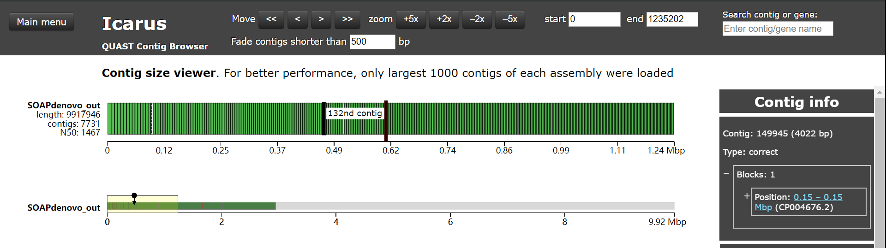

---
output:
  word_document:
    path: C:/Users/Nature/Desktop/STUDY/Programming/Works/Programming-In-Learning-Bioinformatics-ZeFengZhu/Omics/Genomics/基因组信息学_实验记录.docx
export_on_save:
pandoc: true
---

<br /><br /><br /><br /><br /><br /><br />
<center><h1>基因组信息学：实验记录</h1></center>
<br /><br /><br /><br /><br /><br /><br /><br /><br /><br /><br /><br /><br /><br /><br /><br /><br /><br /><br /><br /><br /><br /><br /><br /><br /><br /><br /><br /><br /><br /><br /><br /><br /><br /><br /><br /><br /><br /><br /><br /><br /><br /><br />
<p><center>年级：2017级</center></p>
<p><center>专业：生物信息学</center></p>
<p><center>学号：1730416009</center></p>
<p><center>姓名：朱泽峰</center></p>
<br /><br /><br /><br /><br /><br /><br /><br />
<center><h2>目录</h2></center>

- [实验项目1：基因组测序模拟](#%e5%ae%9e%e9%aa%8c%e9%a1%b9%e7%9b%ae1%e5%9f%ba%e5%9b%a0%e7%bb%84%e6%b5%8b%e5%ba%8f%e6%a8%a1%e6%8b%9f)
  - [实验目的](#%e5%ae%9e%e9%aa%8c%e7%9b%ae%e7%9a%84)
  - [实验流程](#%e5%ae%9e%e9%aa%8c%e6%b5%81%e7%a8%8b)
  - [1. 基因组测序模拟工具相关文献资料的调研](#1-%e5%9f%ba%e5%9b%a0%e7%bb%84%e6%b5%8b%e5%ba%8f%e6%a8%a1%e6%8b%9f%e5%b7%a5%e5%85%b7%e7%9b%b8%e5%85%b3%e6%96%87%e7%8c%ae%e8%b5%84%e6%96%99%e7%9a%84%e8%b0%83%e7%a0%94)
    - [From pubmed](#from-pubmed)
  - [2. 查阅 art_illumina 软件中的常用测序平台信息](#2-%e6%9f%a5%e9%98%85-artillumina-%e8%bd%af%e4%bb%b6%e4%b8%ad%e7%9a%84%e5%b8%b8%e7%94%a8%e6%b5%8b%e5%ba%8f%e5%b9%b3%e5%8f%b0%e4%bf%a1%e6%81%af)
  - [3. 基因组测序模拟软件的安装和预测](#3-%e5%9f%ba%e5%9b%a0%e7%bb%84%e6%b5%8b%e5%ba%8f%e6%a8%a1%e6%8b%9f%e8%bd%af%e4%bb%b6%e7%9a%84%e5%ae%89%e8%a3%85%e5%92%8c%e9%a2%84%e6%b5%8b)
    - [3.1 Win10平台](#31-win10%e5%b9%b3%e5%8f%b0)
    - [3.2 Ubuntu](#32-ubuntu)
    - [原理](#%e5%8e%9f%e7%90%86)
    - [IO](#io)
      - [FASTQ](#fastq)
      - [SAM](#sam)
      - [STAT](#stat)
  - [4. 基因组数据下载](#4-%e5%9f%ba%e5%9b%a0%e7%bb%84%e6%95%b0%e6%8d%ae%e4%b8%8b%e8%bd%bd)
    - [4.1 搜索数据](#41-%e6%90%9c%e7%b4%a2%e6%95%b0%e6%8d%ae)
    - [4.2 基因组组装序列数据下载](#42-%e5%9f%ba%e5%9b%a0%e7%bb%84%e7%bb%84%e8%a3%85%e5%ba%8f%e5%88%97%e6%95%b0%e6%8d%ae%e4%b8%8b%e8%bd%bd)
    - [4.3 基因组测序数据下载[拓展内容]](#43-%e5%9f%ba%e5%9b%a0%e7%bb%84%e6%b5%8b%e5%ba%8f%e6%95%b0%e6%8d%ae%e4%b8%8b%e8%bd%bd%e6%8b%93%e5%b1%95%e5%86%85%e5%ae%b9)
      - [4.3.1 信息](#431-%e4%bf%a1%e6%81%af)
      - [4.3.2 利用NCBI SRA Toolkit下载和提取该测序数据](#432-%e5%88%a9%e7%94%a8ncbi-sra-toolkit%e4%b8%8b%e8%bd%bd%e5%92%8c%e6%8f%90%e5%8f%96%e8%af%a5%e6%b5%8b%e5%ba%8f%e6%95%b0%e6%8d%ae)
      - [4.3.3 基因组测序模拟的数据模型(profile)创建](#433-%e5%9f%ba%e5%9b%a0%e7%bb%84%e6%b5%8b%e5%ba%8f%e6%a8%a1%e6%8b%9f%e7%9a%84%e6%95%b0%e6%8d%ae%e6%a8%a1%e5%9e%8bprofile%e5%88%9b%e5%bb%ba)
  - [5. 基因组测序模拟](#5-%e5%9f%ba%e5%9b%a0%e7%bb%84%e6%b5%8b%e5%ba%8f%e6%a8%a1%e6%8b%9f)
    - [5.1 使用art系列软件, 对下载基因组序列进行全基因组测序进行双末端模拟](#51-%e4%bd%bf%e7%94%a8art%e7%b3%bb%e5%88%97%e8%bd%af%e4%bb%b6-%e5%af%b9%e4%b8%8b%e8%bd%bd%e5%9f%ba%e5%9b%a0%e7%bb%84%e5%ba%8f%e5%88%97%e8%bf%9b%e8%a1%8c%e5%85%a8%e5%9f%ba%e5%9b%a0%e7%bb%84%e6%b5%8b%e5%ba%8f%e8%bf%9b%e8%a1%8c%e5%8f%8c%e6%9c%ab%e7%ab%af%e6%a8%a1%e6%8b%9f)
    - [5.2 使用合适的软件或工具来查看模拟运算的输出结果文件及其内容。](#52-%e4%bd%bf%e7%94%a8%e5%90%88%e9%80%82%e7%9a%84%e8%bd%af%e4%bb%b6%e6%88%96%e5%b7%a5%e5%85%b7%e6%9d%a5%e6%9f%a5%e7%9c%8b%e6%a8%a1%e6%8b%9f%e8%bf%90%e7%ae%97%e7%9a%84%e8%be%93%e5%87%ba%e7%bb%93%e6%9e%9c%e6%96%87%e4%bb%b6%e5%8f%8a%e5%85%b6%e5%86%85%e5%ae%b9)
    - [5.3 统计不同参数设置下的模拟结果](#53-%e7%bb%9f%e8%ae%a1%e4%b8%8d%e5%90%8c%e5%8f%82%e6%95%b0%e8%ae%be%e7%bd%ae%e4%b8%8b%e7%9a%84%e6%a8%a1%e6%8b%9f%e7%bb%93%e6%9e%9c)
      - [5.3.1 SRR800817测序覆盖度理论值](#531-srr800817%e6%b5%8b%e5%ba%8f%e8%a6%86%e7%9b%96%e5%ba%a6%e7%90%86%e8%ae%ba%e5%80%bc)
      - [5.3.2 不同参数设置下覆盖度数据](#532-%e4%b8%8d%e5%90%8c%e5%8f%82%e6%95%b0%e8%ae%be%e7%bd%ae%e4%b8%8b%e8%a6%86%e7%9b%96%e5%ba%a6%e6%95%b0%e6%8d%ae)
- [实验项目2：序列组装](#%e5%ae%9e%e9%aa%8c%e9%a1%b9%e7%9b%ae2%e5%ba%8f%e5%88%97%e7%bb%84%e8%a3%85)
  - [实验目的](#%e5%ae%9e%e9%aa%8c%e7%9b%ae%e7%9a%84-1)
  - [实验流程](#%e5%ae%9e%e9%aa%8c%e6%b5%81%e7%a8%8b-1)
  - [1. 数据准备](#1-%e6%95%b0%e6%8d%ae%e5%87%86%e5%a4%87)
    - [1.1 准备原始基因组组装序列](#11-%e5%87%86%e5%a4%87%e5%8e%9f%e5%a7%8b%e5%9f%ba%e5%9b%a0%e7%bb%84%e7%bb%84%e8%a3%85%e5%ba%8f%e5%88%97)
    - [1.2 利用art_illumina模拟双末端测序](#12-%e5%88%a9%e7%94%a8artillumina%e6%a8%a1%e6%8b%9f%e5%8f%8c%e6%9c%ab%e7%ab%af%e6%b5%8b%e5%ba%8f)
    - [1.3 创建参考基因组](#13-%e5%88%9b%e5%bb%ba%e5%8f%82%e8%80%83%e5%9f%ba%e5%9b%a0%e7%bb%84)
  - [2. 质控分析](#2-%e8%b4%a8%e6%8e%a7%e5%88%86%e6%9e%90)
  - [3. 查阅两套数据的分析结果并分析结果](#3-%e6%9f%a5%e9%98%85%e4%b8%a4%e5%a5%97%e6%95%b0%e6%8d%ae%e7%9a%84%e5%88%86%e6%9e%90%e7%bb%93%e6%9e%9c%e5%b9%b6%e5%88%86%e6%9e%90%e7%bb%93%e6%9e%9c)
    - [3.1 pair1](#31-pair1)
    - [3.2 pair2](#32-pair2)
    - [3.3 mate-pair1](#33-mate-pair1)
    - [3.4 mate-pair2](#34-mate-pair2)
  - [4. 测序数据与参考基因组的比对](#4-%e6%b5%8b%e5%ba%8f%e6%95%b0%e6%8d%ae%e4%b8%8e%e5%8f%82%e8%80%83%e5%9f%ba%e5%9b%a0%e7%bb%84%e7%9a%84%e6%af%94%e5%af%b9)
    - [4.1 利用bowtie2，把上述两套高通量测序数据与之前准备好的基因组索引文件进行比对，保留比对结果](#41-%e5%88%a9%e7%94%a8bowtie2%e6%8a%8a%e4%b8%8a%e8%bf%b0%e4%b8%a4%e5%a5%97%e9%ab%98%e9%80%9a%e9%87%8f%e6%b5%8b%e5%ba%8f%e6%95%b0%e6%8d%ae%e4%b8%8e%e4%b9%8b%e5%89%8d%e5%87%86%e5%a4%87%e5%a5%bd%e7%9a%84%e5%9f%ba%e5%9b%a0%e7%bb%84%e7%b4%a2%e5%bc%95%e6%96%87%e4%bb%b6%e8%bf%9b%e8%a1%8c%e6%af%94%e5%af%b9%e4%bf%9d%e7%95%99%e6%af%94%e5%af%b9%e7%bb%93%e6%9e%9c)
    - [4.2 利用samtools对比对结果并进行简单的统计分析](#42-%e5%88%a9%e7%94%a8samtools%e5%af%b9%e6%af%94%e5%af%b9%e7%bb%93%e6%9e%9c%e5%b9%b6%e8%bf%9b%e8%a1%8c%e7%ae%80%e5%8d%95%e7%9a%84%e7%bb%9f%e8%ae%a1%e5%88%86%e6%9e%90)
    - [4.3 解读samtools stats的统计结果,利用plot-bamstats工具对输出的结果文档进行可视化](#43-%e8%a7%a3%e8%af%bbsamtools-stats%e7%9a%84%e7%bb%9f%e8%ae%a1%e7%bb%93%e6%9e%9c%e5%88%a9%e7%94%a8plot-bamstats%e5%b7%a5%e5%85%b7%e5%af%b9%e8%be%93%e5%87%ba%e7%9a%84%e7%bb%93%e6%9e%9c%e6%96%87%e6%a1%a3%e8%bf%9b%e8%a1%8c%e5%8f%af%e8%a7%86%e5%8c%96)
  - [5. 序列组装及结果分析](#5-%e5%ba%8f%e5%88%97%e7%bb%84%e8%a3%85%e5%8f%8a%e7%bb%93%e6%9e%9c%e5%88%86%e6%9e%90)
    - [5.1 对上述高通量测序数据进行组装](#51-%e5%af%b9%e4%b8%8a%e8%bf%b0%e9%ab%98%e9%80%9a%e9%87%8f%e6%b5%8b%e5%ba%8f%e6%95%b0%e6%8d%ae%e8%bf%9b%e8%a1%8c%e7%bb%84%e8%a3%85)
    - [5.2 利用Quast将组装结果中包含contigs和scaffolds序列的文档与参考基因组进行对比](#52-%e5%88%a9%e7%94%a8quast%e5%b0%86%e7%bb%84%e8%a3%85%e7%bb%93%e6%9e%9c%e4%b8%ad%e5%8c%85%e5%90%abcontigs%e5%92%8cscaffolds%e5%ba%8f%e5%88%97%e7%9a%84%e6%96%87%e6%a1%a3%e4%b8%8e%e5%8f%82%e8%80%83%e5%9f%ba%e5%9b%a0%e7%bb%84%e8%bf%9b%e8%a1%8c%e5%af%b9%e6%af%94)
    - [5.3 查看并分析比对结果，关注实际覆盖率等重要评估指标](#53-%e6%9f%a5%e7%9c%8b%e5%b9%b6%e5%88%86%e6%9e%90%e6%af%94%e5%af%b9%e7%bb%93%e6%9e%9c%e5%85%b3%e6%b3%a8%e5%ae%9e%e9%99%85%e8%a6%86%e7%9b%96%e7%8e%87%e7%ad%89%e9%87%8d%e8%a6%81%e8%af%84%e4%bc%b0%e6%8c%87%e6%a0%87)
- [实验项目3: 基因组注释之同源搜索](#%e5%ae%9e%e9%aa%8c%e9%a1%b9%e7%9b%ae3-%e5%9f%ba%e5%9b%a0%e7%bb%84%e6%b3%a8%e9%87%8a%e4%b9%8b%e5%90%8c%e6%ba%90%e6%90%9c%e7%b4%a2)
  - [实验目的](#%e5%ae%9e%e9%aa%8c%e7%9b%ae%e7%9a%84-2)
  - [实验流程](#%e5%ae%9e%e9%aa%8c%e6%b5%81%e7%a8%8b-2)
  - [1. 数据准备及预处理](#1-%e6%95%b0%e6%8d%ae%e5%87%86%e5%a4%87%e5%8f%8a%e9%a2%84%e5%a4%84%e7%90%86)
    - [1.1 基因组序列](#11-%e5%9f%ba%e5%9b%a0%e7%bb%84%e5%ba%8f%e5%88%97)
    - [1.2 已知蛋白序列](#12-%e5%b7%b2%e7%9f%a5%e8%9b%8b%e7%99%bd%e5%ba%8f%e5%88%97)
  - [2 创建本地 BLAST 数据库](#2-%e5%88%9b%e5%bb%ba%e6%9c%ac%e5%9c%b0-blast-%e6%95%b0%e6%8d%ae%e5%ba%93)
  - [3全基因组的同源基因搜索](#3%e5%85%a8%e5%9f%ba%e5%9b%a0%e7%bb%84%e7%9a%84%e5%90%8c%e6%ba%90%e5%9f%ba%e5%9b%a0%e6%90%9c%e7%b4%a2)
    - [3.1 使用 tblastn 程序, 把已知蛋白质序列和上述建立的本地 BLAST 数据库进行比对](#31-%e4%bd%bf%e7%94%a8-tblastn-%e7%a8%8b%e5%ba%8f-%e6%8a%8a%e5%b7%b2%e7%9f%a5%e8%9b%8b%e7%99%bd%e8%b4%a8%e5%ba%8f%e5%88%97%e5%92%8c%e4%b8%8a%e8%bf%b0%e5%bb%ba%e7%ab%8b%e7%9a%84%e6%9c%ac%e5%9c%b0-blast-%e6%95%b0%e6%8d%ae%e5%ba%93%e8%bf%9b%e8%a1%8c%e6%af%94%e5%af%b9)
    - [3.2 使用 blast92gff3.pl 和 blast2gff.py 程序，分别把结果转成 GFF3 格式](#32-%e4%bd%bf%e7%94%a8-blast92gff3pl-%e5%92%8c-blast2gffpy-%e7%a8%8b%e5%ba%8f%e5%88%86%e5%88%ab%e6%8a%8a%e7%bb%93%e6%9e%9c%e8%bd%ac%e6%88%90-gff3-%e6%a0%bc%e5%bc%8f)
    - [3.3 比较两个程序转换结果的异同之处](#33-%e6%af%94%e8%be%83%e4%b8%a4%e4%b8%aa%e7%a8%8b%e5%ba%8f%e8%bd%ac%e6%8d%a2%e7%bb%93%e6%9e%9c%e7%9a%84%e5%bc%82%e5%90%8c%e4%b9%8b%e5%a4%84)
    - [3.4 排除 blast 比对结果中的冗余项](#34-%e6%8e%92%e9%99%a4-blast-%e6%af%94%e5%af%b9%e7%bb%93%e6%9e%9c%e4%b8%ad%e7%9a%84%e5%86%97%e4%bd%99%e9%a1%b9)
  - [4 同源搜索结果的评估](#4-%e5%90%8c%e6%ba%90%e6%90%9c%e7%b4%a2%e7%bb%93%e6%9e%9c%e7%9a%84%e8%af%84%e4%bc%b0)
- [实验项目4: 基因组注释之从头预测与结构建模](#%e5%ae%9e%e9%aa%8c%e9%a1%b9%e7%9b%ae4-%e5%9f%ba%e5%9b%a0%e7%bb%84%e6%b3%a8%e9%87%8a%e4%b9%8b%e4%bb%8e%e5%a4%b4%e9%a2%84%e6%b5%8b%e4%b8%8e%e7%bb%93%e6%9e%84%e5%bb%ba%e6%a8%a1)
  - [实验目的](#%e5%ae%9e%e9%aa%8c%e7%9b%ae%e7%9a%84-3)
  - [实验流程](#%e5%ae%9e%e9%aa%8c%e6%b5%81%e7%a8%8b-3)
  - [1. 基因组数据准备](#1-%e5%9f%ba%e5%9b%a0%e7%bb%84%e6%95%b0%e6%8d%ae%e5%87%86%e5%a4%87)
  - [2. 从头基因预测软件的安装与测试](#2-%e4%bb%8e%e5%a4%b4%e5%9f%ba%e5%9b%a0%e9%a2%84%e6%b5%8b%e8%bd%af%e4%bb%b6%e7%9a%84%e5%ae%89%e8%a3%85%e4%b8%8e%e6%b5%8b%e8%af%95)
  - [3. 全基因组的从头基因预测](#3-%e5%85%a8%e5%9f%ba%e5%9b%a0%e7%bb%84%e7%9a%84%e4%bb%8e%e5%a4%b4%e5%9f%ba%e5%9b%a0%e9%a2%84%e6%b5%8b)
    - [3.1 任选一个能够进行从头预测基因的软件，如 Augustus. GeneMarkES/ET 等](#31-%e4%bb%bb%e9%80%89%e4%b8%80%e4%b8%aa%e8%83%bd%e5%a4%9f%e8%bf%9b%e8%a1%8c%e4%bb%8e%e5%a4%b4%e9%a2%84%e6%b5%8b%e5%9f%ba%e5%9b%a0%e7%9a%84%e8%bd%af%e4%bb%b6%e5%a6%82-augustus-genemarkeset-%e7%ad%89)
    - [3.2 使用该软件对第 1 步准备的基因组序列进行基因预测分析，](#32-%e4%bd%bf%e7%94%a8%e8%af%a5%e8%bd%af%e4%bb%b6%e5%af%b9%e7%ac%ac-1-%e6%ad%a5%e5%87%86%e5%a4%87%e7%9a%84%e5%9f%ba%e5%9b%a0%e7%bb%84%e5%ba%8f%e5%88%97%e8%bf%9b%e8%a1%8c%e5%9f%ba%e5%9b%a0%e9%a2%84%e6%b5%8b%e5%88%86%e6%9e%90)
  - [4 从头基因预测结果的鉴别](#4-%e4%bb%8e%e5%a4%b4%e5%9f%ba%e5%9b%a0%e9%a2%84%e6%b5%8b%e7%bb%93%e6%9e%9c%e7%9a%84%e9%89%b4%e5%88%ab)
    - [4.1 已知蛋白序列](#41-%e5%b7%b2%e7%9f%a5%e8%9b%8b%e7%99%bd%e5%ba%8f%e5%88%97)
    - [4.2 创建本地 BLAST 数据库](#42-%e5%88%9b%e5%bb%ba%e6%9c%ac%e5%9c%b0-blast-%e6%95%b0%e6%8d%ae%e5%ba%93)
    - [4.3 从GFF文档中提取FASTA序列](#43-%e4%bb%8egff%e6%96%87%e6%a1%a3%e4%b8%ad%e6%8f%90%e5%8f%96fasta%e5%ba%8f%e5%88%97)
      - [GFF中序列格式范例](#gff%e4%b8%ad%e5%ba%8f%e5%88%97%e6%a0%bc%e5%bc%8f%e8%8c%83%e4%be%8b)
      - [提取序列函数](#%e6%8f%90%e5%8f%96%e5%ba%8f%e5%88%97%e5%87%bd%e6%95%b0)
    - [4.4 使用合适的 blast 程序对该预测基因与已知蛋白序列进行比对,以此来鉴别从头预测出来的基因](#44-%e4%bd%bf%e7%94%a8%e5%90%88%e9%80%82%e7%9a%84-blast-%e7%a8%8b%e5%ba%8f%e5%af%b9%e8%af%a5%e9%a2%84%e6%b5%8b%e5%9f%ba%e5%9b%a0%e4%b8%8e%e5%b7%b2%e7%9f%a5%e8%9b%8b%e7%99%bd%e5%ba%8f%e5%88%97%e8%bf%9b%e8%a1%8c%e6%af%94%e5%af%b9%e4%bb%a5%e6%ad%a4%e6%9d%a5%e9%89%b4%e5%88%ab%e4%bb%8e%e5%a4%b4%e9%a2%84%e6%b5%8b%e5%87%ba%e6%9d%a5%e7%9a%84%e5%9f%ba%e5%9b%a0)
    - [4.5 把 4.4 结果合并到 3.2 获得的 GFF 格式结果中](#45-%e6%8a%8a-44-%e7%bb%93%e6%9e%9c%e5%90%88%e5%b9%b6%e5%88%b0-32-%e8%8e%b7%e5%be%97%e7%9a%84-gff-%e6%a0%bc%e5%bc%8f%e7%bb%93%e6%9e%9c%e4%b8%ad)
      - [信息整合脚本](#%e4%bf%a1%e6%81%af%e6%95%b4%e5%90%88%e8%84%9a%e6%9c%ac)
  - [5. 从头预测结果的评估](#5-%e4%bb%8e%e5%a4%b4%e9%a2%84%e6%b5%8b%e7%bb%93%e6%9e%9c%e7%9a%84%e8%af%84%e4%bc%b0)
    - [5.1 gffcompare对比](#51-gffcompare%e5%af%b9%e6%af%94)
    - [5.2 gffcompare结果解析](#52-gffcompare%e7%bb%93%e6%9e%9c%e8%a7%a3%e6%9e%90)
    - [5.3 与实验三/同源预测结果进行对比](#53-%e4%b8%8e%e5%ae%9e%e9%aa%8c%e4%b8%89%e5%90%8c%e6%ba%90%e9%a2%84%e6%b5%8b%e7%bb%93%e6%9e%9c%e8%bf%9b%e8%a1%8c%e5%af%b9%e6%af%94)
- [实验项目5: 基因组注释之启动子分析和预测](#%e5%ae%9e%e9%aa%8c%e9%a1%b9%e7%9b%ae5-%e5%9f%ba%e5%9b%a0%e7%bb%84%e6%b3%a8%e9%87%8a%e4%b9%8b%e5%90%af%e5%8a%a8%e5%ad%90%e5%88%86%e6%9e%90%e5%92%8c%e9%a2%84%e6%b5%8b)
  - [实验目的](#%e5%ae%9e%e9%aa%8c%e7%9b%ae%e7%9a%84-4)
  - [实验流程](#%e5%ae%9e%e9%aa%8c%e6%b5%81%e7%a8%8b-4)
  - [1. 数据准备](#1-%e6%95%b0%e6%8d%ae%e5%87%86%e5%a4%87-1)
  - [2. 启动子相关DNA元件HMM数据](#2-%e5%90%af%e5%8a%a8%e5%ad%90%e7%9b%b8%e5%85%b3dna%e5%85%83%e4%bb%b6hmm%e6%95%b0%e6%8d%ae)
    - [2.1 从EPD数据库中下载任意一种启动子相关的DNA元件的HMM数据](#21-%e4%bb%8eepd%e6%95%b0%e6%8d%ae%e5%ba%93%e4%b8%ad%e4%b8%8b%e8%bd%bd%e4%bb%bb%e6%84%8f%e4%b8%80%e7%a7%8d%e5%90%af%e5%8a%a8%e5%ad%90%e7%9b%b8%e5%85%b3%e7%9a%84dna%e5%85%83%e4%bb%b6%e7%9a%84hmm%e6%95%b0%e6%8d%ae)
  - [3 DNA元件的计算鉴别](#3-dna%e5%85%83%e4%bb%b6%e7%9a%84%e8%ae%a1%e7%ae%97%e9%89%b4%e5%88%ab)
    - [3.1 根据该 HMM 数据，编写程序对上述基因组序列进行遍历，计算原始得分](#31-%e6%a0%b9%e6%8d%ae%e8%af%a5-hmm-%e6%95%b0%e6%8d%ae%e7%bc%96%e5%86%99%e7%a8%8b%e5%ba%8f%e5%af%b9%e4%b8%8a%e8%bf%b0%e5%9f%ba%e5%9b%a0%e7%bb%84%e5%ba%8f%e5%88%97%e8%bf%9b%e8%a1%8c%e9%81%8d%e5%8e%86%e8%ae%a1%e7%ae%97%e5%8e%9f%e5%a7%8b%e5%be%97%e5%88%86)
    - [3.2 在计算分值的同时，使用 bootstrap 抽样评估的方法对计算每个片段可靠性p值](#32-%e5%9c%a8%e8%ae%a1%e7%ae%97%e5%88%86%e5%80%bc%e7%9a%84%e5%90%8c%e6%97%b6%e4%bd%bf%e7%94%a8-bootstrap-%e6%8a%bd%e6%a0%b7%e8%af%84%e4%bc%b0%e7%9a%84%e6%96%b9%e6%b3%95%e5%af%b9%e8%ae%a1%e7%ae%97%e6%af%8f%e4%b8%aa%e7%89%87%e6%ae%b5%e5%8f%af%e9%9d%a0%e6%80%a7p%e5%80%bc)
    - [3.3 根据 p 值大小进行过滤](#33-%e6%a0%b9%e6%8d%ae-p-%e5%80%bc%e5%a4%a7%e5%b0%8f%e8%bf%9b%e8%a1%8c%e8%bf%87%e6%bb%a4)
  - [4. 把分析结果与基因组的注释信息进行对比](#4-%e6%8a%8a%e5%88%86%e6%9e%90%e7%bb%93%e6%9e%9c%e4%b8%8e%e5%9f%ba%e5%9b%a0%e7%bb%84%e7%9a%84%e6%b3%a8%e9%87%8a%e4%bf%a1%e6%81%af%e8%bf%9b%e8%a1%8c%e5%af%b9%e6%af%94)
    - [4.1 运行3中编写的代码，得到分析结果](#41-%e8%bf%90%e8%a1%8c3%e4%b8%ad%e7%bc%96%e5%86%99%e7%9a%84%e4%bb%a3%e7%a0%81%e5%be%97%e5%88%b0%e5%88%86%e6%9e%90%e7%bb%93%e6%9e%9c)
    - [4.2 编写代码进行位点可视化](#42-%e7%bc%96%e5%86%99%e4%bb%a3%e7%a0%81%e8%bf%9b%e8%a1%8c%e4%bd%8d%e7%82%b9%e5%8f%af%e8%a7%86%e5%8c%96)
      - [正链](#%e6%ad%a3%e9%93%be)
      - [负链](#%e8%b4%9f%e9%93%be)
      - [预测元件数与基因数的统计](#%e9%a2%84%e6%b5%8b%e5%85%83%e4%bb%b6%e6%95%b0%e4%b8%8e%e5%9f%ba%e5%9b%a0%e6%95%b0%e7%9a%84%e7%bb%9f%e8%ae%a1)
    - [4.3 HMM分类器效果评估](#43-hmm%e5%88%86%e7%b1%bb%e5%99%a8%e6%95%88%e6%9e%9c%e8%af%84%e4%bc%b0)
      - [来自YJM1342的gff文档](#%e6%9d%a5%e8%87%aayjm1342%e7%9a%84gff%e6%96%87%e6%a1%a3)
      - [进一步探究](#%e8%bf%9b%e4%b8%80%e6%ad%a5%e6%8e%a2%e7%a9%b6)
    - [4.4 根据上一步计算的阈值，对第3步的结果进行进一步的筛选，并按照 GFF3 格式保存](#44-%e6%a0%b9%e6%8d%ae%e4%b8%8a%e4%b8%80%e6%ad%a5%e8%ae%a1%e7%ae%97%e7%9a%84%e9%98%88%e5%80%bc%e5%af%b9%e7%ac%ac3%e6%ad%a5%e7%9a%84%e7%bb%93%e6%9e%9c%e8%bf%9b%e8%a1%8c%e8%bf%9b%e4%b8%80%e6%ad%a5%e7%9a%84%e7%ad%9b%e9%80%89%e5%b9%b6%e6%8c%89%e7%85%a7-gff3-%e6%a0%bc%e5%bc%8f%e4%bf%9d%e5%ad%98)
- [实验项目6: 基因组可视化](#%e5%ae%9e%e9%aa%8c%e9%a1%b9%e7%9b%ae6-%e5%9f%ba%e5%9b%a0%e7%bb%84%e5%8f%af%e8%a7%86%e5%8c%96)
  - [实验目的](#%e5%ae%9e%e9%aa%8c%e7%9b%ae%e7%9a%84-5)
  - [1. 基因组测序可视化工具相关文献资料的调研](#1-%e5%9f%ba%e5%9b%a0%e7%bb%84%e6%b5%8b%e5%ba%8f%e5%8f%af%e8%a7%86%e5%8c%96%e5%b7%a5%e5%85%b7%e7%9b%b8%e5%85%b3%e6%96%87%e7%8c%ae%e8%b5%84%e6%96%99%e7%9a%84%e8%b0%83%e7%a0%94)
    - [1.1 Search in Pubmed](#11-search-in-pubmed)
    - [1.2 USCS Genome Browser](#12-uscs-genome-browser)
  - [2. 基因组可视化](#2-%e5%9f%ba%e5%9b%a0%e7%bb%84%e5%8f%af%e8%a7%86%e5%8c%96)
    - [2.1 下载IGV](#21-%e4%b8%8b%e8%bd%bdigv)
    - [2.2 进行基因组本地可视化](#22-%e8%bf%9b%e8%a1%8c%e5%9f%ba%e5%9b%a0%e7%bb%84%e6%9c%ac%e5%9c%b0%e5%8f%af%e8%a7%86%e5%8c%96)
      - [2.2.1 导入基因组](#221-%e5%af%bc%e5%85%a5%e5%9f%ba%e5%9b%a0%e7%bb%84)
      - [2.2.2 处理原GFF注释文件](#222-%e5%a4%84%e7%90%86%e5%8e%9fgff%e6%b3%a8%e9%87%8a%e6%96%87%e4%bb%b6)
      - [2.2.3 导入GFF注释文件](#223-%e5%af%bc%e5%85%a5gff%e6%b3%a8%e9%87%8a%e6%96%87%e4%bb%b6)

## 实验项目1：基因组测序模拟

### 实验目的

1. 加深全基因组鸟枪法测序原理的理解
2. 熟悉和掌握常用基因组测序模拟和评估程序的使用
3. 能够独立地使用自己所掌握统计学分析手段来对实验数据进行对比分析
4. 加强学生自主学习能力
5. 加深统计学在基因组数据分析中的应用
6. 培养学生发现问题, 分析问题和解决问题的能力。


### 实验流程

```viz
digraph flowchart_1 {
    # rankdir=LR;
    fontname="Courier New";
    size="6,4"; ratio = fill;
    node [style="filled,setlinewidth(3)", color="#8383cc", fontname="Courier New", shape="Mrecord",fixedsize=true,width=2.5,fillcolor="#d9e7ee"];
    edge [color="0.635 0.707 0.707", fontname="Courier New"];
    label="基因组测序模拟";
    step1[label="art_illumina调研"];
    step2[label="基因组数据下载"];
    step3[label="基因组测序模拟"];

    sub_step1->step1;
    step1->sub_step2;
    sub_step2->step2;
    step2->step3;
    step3->sub_step31;

    subgraph cluster_1 {
        style=filled;
        color=lightgrey;
        sub_step1[label="文献调研"];
        sub_step2[label="软件的安装和测试"];
        label="拓展内容";
        subgraph cluster_2{
            color=grey;
            sub_step31[label="基因组测序数据下载"];
            sub_step32[label="相关的统计计算"];
            sub_step33[label="art_profile_illumina"];
            sub_step34[label="对比profile"];
            sub_step31->sub_step32->sub_step33->sub_step34;
            label="数据模型的创建";
        }
    }
}
```

### 1. 基因组测序模拟工具相关文献资料的调研

#### From `pubmed`

> There are a number of existing software packages available for generating synthetic NGS read data, each tending to specialize on a particular attribute of a dataset. For example, ART [2], CuReSim [3], GemSim [4], and pIRS [5] focus on realistically emulating the biases inherent in the base calling of various next-generation sequencing (NGS) platforms. [💭](https://www.ncbi.nlm.nih.gov/pmc/articles/PMC5125660/ "Link")

__CureSim__

> ___Comparison of mapping algorithms used in high-throughput sequencing: application to Ion Torrent data___ Ségolène Caboche,corresponding author1,4 Christophe Audebert,2,4 Yves Lemoine,1,3,4 and David Hot1,3,4

Curesim(一种新的读取模拟器)可以通过调整错误类型的参数，为任何类型的 __HTS(高通量测序)技术__ 生成定制的基准数据。
其本质是一个基准程序来比较使用真实和模拟数据集的HTS中的映射算法，并考虑了四个评估标准:

* 计算资源和时间需求
* 映射的稳健性
* 能够报告重复区域的读取位置
* 并能够检索真实的遗传变异位置。

为度量稳健性，其引入了一个新的定义，用于正确映射的读取，不仅要考虑读取的预期起始位置，还要考虑结束位置以及索引和替换的数量。

> 由于基因组重新测序（全基因组测序和靶向测序）等特定应用的开发，HTS在遗传学和基因组学方面产生了大量知识。这种技术演变与开发新算法以处理所产生的reads的数量和质量并行。重新测序方法的基本分析步骤是将reads映射到参考基因组上。该步骤涉及将读数准确定位到参考基因组序列上，这非常重要，因为它决定了下游分析的全局质量。用于此步骤的算法称为映射器。映射器必须敏感且准确，并且速度要快，不能要太多的计算。他们应该能够在参考基因组上找到每一个读数的真实位置，并理想地区分技术测序错误和自然遗传变异。[💭](https://www.ncbi.nlm.nih.gov/pmc/articles/PMC4051166/ "Link")

### 2. 查阅 art_illumina 软件中的常用测序平台信息

[💭](https://www.cnblogs.com/think-and-do/p/6638157.html "Link")

```
Mode                LastWriteTime         Length Name
----                -------------         ------ ----
------         2016/6/5     22:41         234519 Emp100R1.txt
------         2016/6/5     22:41         409657 EmpMiSeq250R1.txt
------         2016/6/5     22:41          77918 EmpR36R1.txt
------         2016/6/5     22:41         150841 HiSeq2500L125R1.txt
...
```

查阅```art_illumina_README```可以知道，通过查看```\art_bin_MountRainier\Illumina_profiles```目录下的文件可以查看art_illumina支持的测序

### 3. 基因组测序模拟软件的安装和预测

__ART软件下载__

* <https://www.niehs.nih.gov/research/resources/software/biostatistics/art/>
* <https://www.niehs.nih.gov/research/resources/assets/docs/artsrcmountrainier2016.06.05linux.tgz>

#### 3.1 Win10平台

<table align="center">
  <tr>
    <td>
      </img>
    </td>
    <td>
      </img>
    </td>
  </tr>
  <tr>
    <td>art软件下载</td>
    <td>art命令行界面</td>
  </tr>
</table>

考虑到Windows平台的art系列软件运行不稳定, 同时在Ubuntu下进行实验。

#### 3.2 Ubuntu

```bash
# cd 到目标安装目录
wget https://www.niehs.nih.gov/research/resources/assets/docs/artsrcmountrainier2016.06.05linux.tgz
tar -d artsrcmountrainier2016.06.05linux.tgz
cd art_src_MountRainier_Linux/
cat README
```

查看安装要求：

```README
...
COMPILATION AND INSTALLATION

	PREREQUISITES:

		1) GNU g++ 4.0 or above (http://gcc.gnu.org/install)
		2) GNU gsl library (http://www.gnu.org/s/gsl/)
...
```

补安装G++与GSL库:

```bash
# cd 到顶层目录
apt-get install g++
apt-get install libgsl0-dev
```

执行ART系列的安装

```bash
# cd 到目标安装目录
./configure --prefix=$HOME
make
make install
```

到此软件安装完成。

#### 原理

使用内置的，特定于技术的读取错误模型和在大型测序数据集中凭经验参数化的基本质量值配置文件，即创建Profile文档，利用经验分布(位点. 质量分数. 频数. 碱基四维度信息)，来模拟测序过程，从而生成模拟的测序reads。

#### IO

由art_illumina的参数设置可以看到，可以进行多种覆盖度. 单双端测序. 多种测序平台等的模拟测序。

同时，以基因组文件为输入文件，输出FASTQ格式的序列文档(即包含序列质量信息)，以及aln,sam,stat格式的比对文档。

##### FASTQ

* 每条记录(Read)有四行信息
* 第一行：Read的名称，实验手段，测序平台等
* 第二行：Sequence
* 第三行：ignore
* 第四行：Base Quality
  * ASCII编码的质量分数Q
  * $Q=-10\log_{10}p$
  * p: Probability of incorrect base call
  * Phred33: ASCII=chr(Q + 33)
  * i.e p=0.05 -> Q = 13.01.. -> ```'.'```


##### SAM

一种序列比对格式标准， 由sanger制 定，是以TAB为分割符的文本格式。主要应用于测序序列 mapping到基因组上 的结果表示，表示任意的多重比对结果。

* 注释信息部分 (```@```符合开头)
* 比对结果部分

##### STAT

表征基因组各个染色体上每个位点的覆盖度

* 参考位置
* 从该位置起始的reads数量
* 覆盖到该位置的reads数量

理论上每个位点对应起始的read数量大致一致，且数量不多；而覆盖到该位点的reads数量与其位点也应无明显区别，且数量应比起始read多。

### 4. 基因组数据下载

#### 4.1 搜索数据		

key|value
-|-
Organism/Name|Saccharomyces cerevisiae YJM1342
Strain|YJM1342
BioSample|SAMN01923166
BioProject|PRJNA189900
Assembly|GCA_000977265.3
Size (Mb)|12.6226
GC%|38.48
WGS|\-
Scaffolds|17
Gene|6912
Protein|5409
Release Date|2015/02/24
Modify Date|2015/04/09

于Genome数据库搜索，选择菌株 (菌株编号 YJM1342)；菌株信息 (有对应基因及蛋白)如上表。

#### 4.2 基因组组装序列数据下载

下载链接

```bash
# YJM1342 基因组序列文档
wget ftp://ftp.ncbi.nlm.nih.gov/genomes/all/GCA/000/977/265/GCA_000977265.3_Sc_YJM1342_v1/GCA_000977265.3_Sc_YJM1342_v1_genomic.fna.gz
gzip -d GCA_000977265.3_Sc_YJM1342_v1_genomic.fna.gz
# YJM1342 基因组注释文档
wget ftp://ftp.ncbi.nlm.nih.gov/genomes/all/GCA/000/977/265/GCA_000977265.3_Sc_YJM1342_v1/GCA_000977265.3_Sc_YJM1342_v1_genomic.gff.gz
gzip -d GCA_000977265.3_Sc_YJM1342_v1_genomic.gff.gz
```

序列文档在接下来的模拟序列组装中用到，注释文档待下次实验利用。

文档名称：

```bash
GCA_000977265.3_Sc_YJM1342_v1_genomic.fna
GCA_000977265.3_Sc_YJM1342_v1_genomic.gff
```

#### 4.3 基因组测序数据下载[拓展内容]

为生成独立Profile,因此需要下载测序数据。

<table align="center">
  <tr>
    <td>
      </img>
    </td>
  </tr>
  <tr>
    <td>菌株SRA测序信息</td>
  </tr>
</table>

##### 4.3.1 信息

* Instrument: Illumina HiSeq 2000
* Strategy: WGS
* Source: GENOMIC
* Selection: RANDOM
* Layout: __PAIRED__

可以看到该测序数据为双末端测序而产生,在HiSeq 2000平台下完成测序。

##### 4.3.2 利用NCBI SRA Toolkit下载和提取该测序数据

```bash
# 下载 sra-toolkit
apt install sra-toolkit
# cd到目标路径
wget https://sra-downloadb.be-md.ncbi.nlm.nih.gov/sos/sra-pub-run-2/SRR800817/SRR800817.1

# 或
fastq-dump --split-3 SRR800817
# 得文件：
 SRR800817.1
 SRR800817_1.fastq
 SRR800817_2.fastq
```

##### 4.3.3 基因组测序模拟的数据模型(profile)创建

```bash
../art_src_MountRainier_Linux/ART_profiler_illumina/art_profiler_illumina HiSeq2k_YJM1342 SRA_files fastq 20
```

查看模拟运算的输出结果文件:

```bash
head -n 10 HiSeq2k_YJM1342R1.txt
```

```txt
.	0	3	8	11	17	19	21	23	24	26	27	28	29	30	31	32	34	35
.	0	8	9	11	19	21	22	24	26	34	50	82	111	113	189	625	712	1299
.	1	3	8	11	13	17	20	23	24	25	26	27	28	29	30	31	32	34	35
.	1	27	28	34	36	45	46	49	56	57	62	82	101	122	124	173	536	581	1299
.	2	3	8	11	16	17	20	21	23	24	26	27	28	29	30	31	32	34	35
.	2	9	10	14	24	34	37	38	41	44	53	76	106	125	128	173	514	567	1299
.	3	3	8	11	13	17	18	20	23	24	25	26	27	28	29	31	32	33	34	36	38
.	3	8	9	14	15	17	21	24	30	33	34	35	40	45	59	73	81	122	153	403	1299
.	4	3	8	11	17	18	20	21	23	24	26	27	28	29	31	32	33	34	36	38
.	4	21	22	30	36	42	44	46	51	53	57	66	69	76	86	87	123	158	413	1299
...
```

说明Profile成功生成。下面与 illumina Read Profile 进行对比：

```bash
python3 visualize_HiSeq2k_Profile.py -i ./Illumina_profiles/
```

* 输入文件
  * HiSeq2kL100R1.txt
  * HiSeq2kL100R2.txt
  * HiSeq2k_YJM1342R1.txt
  * HiSeq2k_YJM1342R2.txt
* 输出

<table align="center">
  <tr>
    <td>
      </img>
    </td>
    <td>
      </img>
    </td>
    <td>
      </img>
    </td>
    <td>
      </img>
    </td>
  </tr>
  <tr>
    <td>YJM1342R1 质量分数</td>
    <td>YJM1342R1 频数</td>
    <td>YJM1342R2 质量分数</td>
    <td>YJM1342R2 频数</td>
  </tr>
  <tr>
    <td></img></td>
    <td></img></td>
    <td></img></td>
    <td></img></td>
  </tr>
  <tr>
    <td>HiSeq2kL100R1 质量分数</td>
    <td>HiSeq2kL100R1 频数</td>
    <td>HiSeq2kL100R2 质量分数</td>
    <td>HiSeq2kL100R2 频数</td>
  </tr>
</table>

途中列的不同颜色表示不同碱基，横轴为位点，热图展示频数或质量分数。可以看到二者的质量分数以及频数分布有所不同，需进行下一步的统计性比较。

由profile的位点. 质量分数. 频数. 碱基四个维度的数据进行设计：

* 把不同碱基数据分离，每组数据只具有位点. 质量分数. 频数三维信息
* 将每组中的每个位点对应质量分数的频数数据转化为概率形式(频数/该位点所有质量分数的总频数)
* 上一步即得到了一概率矩阵，可检验是否符合正态分布，进而进行多重检验或方差分析，否则进行Kruskal-Wallis秩和检验(两样本的Wilcoxon方法在多于两样本时的推广)，paired(配伍组)设计中，多个样本的比较，若它们的总体不能满足正态性和方差齐次性的要求，可采用Friedman秩和检验

### 5. 基因组测序模拟

#### 5.1 使用art系列软件, 对下载基因组序列进行全基因组测序进行双末端模拟

首先进行覆盖度为10的初步运行，判断软件是否可以正常运行，示例脚本：

```bash
# paired-end read simulation for HiSeq2000
./art_illumina -ss HS20 -sam -i ../../Genomics/data/GCA_000977265.3_Sc_YJM1342_v1_genomic.fna -p -l 100 -f 10 -m 200 -s 10 -o ../../Genomics/data/YJM1342_0918_test
```

参数解析:

* -ss HS20 [测序平台]
* -sam [输出sam文件]
* -i .fna [输入文件，即输入的参考基因组]
* -p [paired-end测序，短插入片段]
* -l 100 [read lengeth，测序长度]
* -f 10 [覆盖度]
* -m 200 [paired-end的片段大小]
* -s 10 [-m片段的偏差]
* -o ../../Genomics/data/YJM1342_0918_test [输出文件名前缀]

此时会出现问题，windows平台运行```art_illumina```时会出现```Error: the number of bases is not equal to the number of quality scores!```的报错内容，且无论更改参数与否，输出内容都不够稳定。因而接下来的实验都在Ubuntu平台下进行。
<br />

#### 5.2 使用合适的软件或工具来查看模拟运算的输出结果文件及其内容。

```bash
head -n 6 ../../Genomics/data/YJM1342_0918_test1.fq
```

```txt
@CP004425.2-20760/1
TAACTGGAAGGAAAAGAACAGATAAATGTCTCAAACAAAGCTGATCAAGCCGCGGTATTTATATGAAACTTTGAACAACTACATCTGCACACATGGGCTC
+
@@CF<FFFHHHGHJGIIIJHIH(?IIIHJGJAJIIJJHJJJHCH@HJIJIJG;'GHH>)FFIHAD=(DFGADBD.AH(+GD+CD+DCDFC;C@DDDDD+C
@CP004425.2-20758/1
CTAATGGAACCAGATCCATTCACCCATAAACGAGAAAATGGTTTGCCCAGTGGAACTTTGACAGCAGACTTCCTTGGTGTATTCAATTTTGTCTGAGAAT
```
对部分fastaq数据进行统计，得出每条Reads每个碱基的Q值，绘出箱型图。
<table align="center">
  <tr>
    <td>
      </img>
    </td>
  </tr>
  <tr>
    <td>每条Reads每个碱基的Q值箱型图</td>
  </tr>
</table>
<br />

可以看到首尾质量稍差，中间较好。

#### 5.3 统计不同参数设置下的模拟结果

##### 5.3.1 SRR800817测序覆盖度理论值

将YJM1342的测序大小除以其基因组大小即可知该SRR800779测序的理论覆盖度等。
|$m$|$e^{-m}$|$1-e^{-m}$|
:-:|:-:|:-:|:-:
|$7G/12.6226M \approx 554.56$|$1.44*10^{-241}$|$\approx 1$|

##### 5.3.2 不同参数设置下覆盖度数据

获取到的 YJM1342 基因组大小:12.6226Mb (Mb: $10^6$ bases)。art_illumina 可以对各个覆盖度进行模拟，需要测试看看具体输出结果的情况:

|模拟的reads长度|paired测序模拟seq-seg平均长度|sdev|覆盖度/单倍体基因组数 ($m$)|理论丢失率 ($P_0 = e^{-m}$)|覆盖率($1-e^{-m}$)|实际覆盖率（根据fq文件序列行/基因组大小得来的覆盖度计算）|
:-:|:-:|:-:|:-:|:-:|:-:|:-:
|100|200|10|1|0.37|0.63|0.39|
|100|200|10|2|0.14|0.86|0.63|
|100|200|10|3|0.05|0.95|0.77|
|100|200|10|4|0.02|0.98|0.86|
|100|200|10|5|0.01|0.99|0.91|

分别设置覆盖度参数，可以看到理论覆盖率随着覆盖度的增加而增加。但是覆盖度到了一定值，覆盖率的增幅逐渐减小,并且逐步靠近1。覆盖度的再提高对于提升覆盖率收效甚微。
从实际覆盖度与对应覆盖率可以看到，实际覆盖度与理论存在差值，使得覆盖率不如理论覆盖率。

将上述表格数据可视化如图：

<table align="center">
  <tr>
    <td>
      </img>
    </td>
  </tr>
  <tr>
    <td>覆盖率y ~ 覆盖度x的曲线图</td>
  </tr>
</table>

下面是输出文件展示：

```txt
# m = 1 -> [Paired-end sequencing simulation] Total CPU time used: 4.82569; Fold Coverage: 1X; The random seed for the run: 1568811948 ...
@CP004425.2-2076/1
GTATTTTTAATCAAGTGGAAAGATGAGTGGAAAAAAGGGCAATGAAATAGAAAAGGACAGGCCTGAAAGGGAAGAATACAAGAAGATTGAGTATATTGGA
...
# m = 2 -> [Paired-end sequencing simulation] Total CPU time used: 9.44064; Fold Coverage: 2X; The random seed for the run: 1568811977 ...
...
# m = 3 -> [Paired-end sequencing simulation] Total CPU time used: 14.4648; Fold Coverage: 3X; The random seed for the run: 1568812008 ...
...
# m = 4 -> [Paired-end sequencing simulation] Total CPU time used: 18.6218; Fold Coverage: 4X; The random seed for the run: 1568812057 ...
...
# m = 5 -> [Paired-end sequencing simulation] Total CPU time used: 23.4467; Fold Coverage: 5X; The random seed for the run: 1568812098 ...
...
```

## 实验项目2：序列组装

### 实验目的

1. 加深序列组装原理的理解
2. 熟悉并掌握常用的序列组装软件的使用（如 AllPathsLG、 soapdenovo2、 Velvet 等）
3. 加强学生自主学习能力
4. 培养学生发现问题、分析问题和解决问题的能力。


### 实验流程

```viz
digraph flowchart_2 {
    # rankdir=LR;
    fontname="Courier New";
    size="6,8"; ratio = fill;
    node [style="filled,setlinewidth(3)", color="#8383cc", fontname="Courier New", shape="Mrecord",fixedsize=true,width=2.5,fillcolor="#d9e7ee"];
    edge [color="0.635 0.707 0.707", fontname="Courier New"];
    label="序列组装";
    step1[label="数据准备"];
    step2[label="fastqc质控分析"];
    # step3[label="与参考基因组的比对"];
    # step4[label="序列组装及结果分析"];

subgraph cluster_1{
    style=filled;
    color=lightgrey;
    node [color=white];
    subgraph cluster_01 {
        color=grey;
        label="art_illumina 模拟双末端测序"
        sub_c1_1[label="短插入片段库"];
        sub_c1_2[label="长插入片段库"];
    }
    label="数据准备"
    sub_c1_3[label="参考基因组文件创建"];
}
    sub_c1_1->sub_c1_3;
    sub_c1_2->sub_c1_3;

    subgraph cluster_0 {
        style=filled;
        color=lightgrey;
        sub_step1[label="文献调研"];
        sub_step2[label="软件的安装和测试"];
        sub_step3[label="序列组装练习"];
        label="拓展内容";
        sub_step1->sub_step2->sub_step3;
    }

    subgraph cluster_2 {
        style=filled;
        color=lightgrey;
        node [color=white];
        sub_c2_step1[label="bowtie2对比"];
        sub_c2_step2[label="samtools统计分析"];
        sub_c2_step3[label="plot-bamstats可视化"];
        label="与参考基因组的比对";
        sub_c2_step1->sub_c2_step2->sub_c2_step3;
    }

    subgraph cluster_3 {
        style=filled;
        color=lightgrey;
        node [color=white];
        sub_c3_step1[label="SOAPdenovo组装"];
        sub_c3_step2[label="Quast分析"];
        label="序列组装及结果分析";
        sub_c3_step1->sub_c3_step2;
    }

    step1->sub_c1_1;
    step1->sub_c1_2;
    sub_step3->step1;
    sub_c1_3->step2[label="bowtie2 -build"];
    step2->sub_c2_step1;
    sub_c2_step3->sub_c3_step1
}
```

### 1. 数据准备

#### 1.1 准备原始基因组组装序列

用以评估后续的序列组装结果。

```bash
fnaPath=../../Genomics/data/YJM1342/GCA_000977265.3_Sc_YJM1342_v1_genomic.fna
```

#### 1.2 利用art_illumina模拟双末端测序

模拟HiSeq2000，reads长度为100。覆盖度参数取19。
短插入片段：

```bash
./art_illumina -ss HS20 -sam -i $fnaPath -p -l 100 -f 19 -m 200 -s 10 -o ../../Genomics/data/YJM1342/Sc_YJM1342_1010_p # 短片段
```

短插入片段pair测序回显：

```bash
Paired-end sequencing simulation

Total CPU time used: 50.4272

The random seed for the run: 1570863424

Parameters used during run
Read Length:	100
Genome masking 'N' cutoff frequency: 	1 in 100
Fold Coverage:            10X
Mean Fragment Length:     200
Standard Deviation:       10
Profile Type:             Combined
ID Tag:

Quality Profile(s)
First Read:   HiSeq 2000 Length 100 R1 (built-in profile)
First Read:   HiSeq 2000 Length 100 R2 (built-in profile)

Output files

FASTQ Sequence Files:
the 1st reads: ../../Genomics/data/YJM1342/Sc_YJM1342_1010_p1.fq
the 2nd reads: ../../Genomics/data/YJM1342/Sc_YJM1342_1010_p2.fq

ALN Alignment Files:
the 1st reads: ../../Genomics/data/YJM1342/Sc_YJM1342_1010_p1.aln
the 2nd reads: ../../Genomics/data/YJM1342/Sc_YJM1342_1010_p2.aln

SAM Alignment File:
../../Genomics/data/YJM1342/Sc_YJM1342_1010_p.sam
```

长插入片段：

```bash
./art_illumina -ss HS20 -sam -i $fnaPath -mp -l 100 -f 19 -m 2500 -s 50 -o ../../Genomics/data/YJM1342/Sc_YJM1342_1010_mp # 长片段
```

长插入片段mate-pair测序回显：

```bash
Matepair-end sequencing simulation

Total CPU time used: 51.9643

The random seed for the run: 1570863518

Parameters used during run
Read Length:	100
Genome masking 'N' cutoff frequency: 	1 in 100
Fold Coverage:            10X
Mean Fragment Length:     2500
Standard Deviation:       50
Profile Type:             Combined
ID Tag:

Quality Profile(s)
First Read:   HiSeq 2000 Length 100 R1 (built-in profile)
First Read:   HiSeq 2000 Length 100 R2 (built-in profile)

Output files

FASTQ Sequence Files:
the 1st reads: ../../Genomics/data/YJM1342/Sc_YJM1342_1010_mp1.fq
the 2nd reads: ../../Genomics/data/YJM1342/Sc_YJM1342_1010_mp2.fq

ALN Alignment Files:
the 1st reads: ../../Genomics/data/YJM1342/Sc_YJM1342_1010_mp1.aln
the 2nd reads: ../../Genomics/data/YJM1342/Sc_YJM1342_1010_mp2.aln

SAM Alignment File:
../../Genomics/data/YJM1342/Sc_YJM1342_1010_mp.sam

```

#### 1.3 创建参考基因组

由于Bowtie2比对时需要用到的参考基因组，现开始创建。

```bash
# move files to IBM

bowtie2-build GCA_000977265.3_Sc_YJM1342_v1_genomic.fna Sc_YJM1342_index # 注意工作目录

# 屏幕回显
Returning block of 2152954
Exited Ebwt loop
fchr[A]: 0
fchr[C]: 3884665
fchr[G]: 6355375
fchr[T]: 8739141
fchr[$]: 12616630
Exiting Ebwt::buildToDisk()
Returning from initFromVector
Wrote 8402213 bytes to primary EBWT file: Sc_YJM1342_index.rev.1.bt2
Wrote 3154164 bytes to secondary EBWT file: Sc_YJM1342_index.rev.2.bt2
Re-opening _in1 and _in2 as input streams
Returning from Ebwt constructor
Headers:
    len: 12616630
    bwtLen: 12616631
    sz: 3154158
    bwtSz: 3154158
    lineRate: 6
    offRate: 4
    offMask: 0xfffffff0
    ftabChars: 10
    eftabLen: 20
    eftabSz: 80
    ftabLen: 1048577
    ftabSz: 4194308
    offsLen: 788540
    offsSz: 3154160
    lineSz: 64
    sideSz: 64
    sideBwtSz: 48
    sideBwtLen: 192
    numSides: 65712
    numLines: 65712
    ebwtTotLen: 4205568
    ebwtTotSz: 4205568
    color: 0
    reverse: 1
Total time for backward call to driver() for mirror index: 00:00:16
```

得到文件如下：

```bash
(/opt/BioBuilds)-bash-4.2$ ll Sc_YJM1342_index.*
-rw-r--r-- 1 s24 student 8402213 Oct 12 15:24 Sc_YJM1342_index.1.bt2
-rw-r--r-- 1 s24 student 3154164 Oct 12 15:24 Sc_YJM1342_index.2.bt2
-rw-r--r-- 1 s24 student     728 Oct 12 15:23 Sc_YJM1342_index.3.bt2
-rw-r--r-- 1 s24 student 3154158 Oct 12 15:23 Sc_YJM1342_index.4.bt2
-rw-r--r-- 1 s24 student 8402213 Oct 12 15:24 Sc_YJM1342_index.rev.1.bt2
-rw-r--r-- 1 s24 student 3154164 Oct 12 15:24 Sc_YJM1342_index.rev.2.bt2
```

### 2. 质控分析

利用fastqc分别对上述两套高通量测序数据进行质控分析。

```bash
mkdir fastqc_out
fastqc -o ./fastqc_out -f fastq -t 10 Sc_YJM1342_1010_p1.fq  Sc_YJM1342_1010_p2.fq

# 屏幕回显
Started analysis of Sc_YJM1342_1010_p1.fq
Started analysis of Sc_YJM1342_1010_p2.fq
...
Analysis complete for Sc_YJM1342_1010_p1.fq
Analysis complete for Sc_YJM1342_1010_p2.fq

fastqc -o ./fastqc_out -f fastq -t 10 Sc_YJM1342_1010_mp1.fq  Sc_YJM1342_1010_mp2.fq

# 屏幕回显
Started analysis of Sc_YJM1342_1010_mp1.fq
Started analysis of Sc_YJM1342_1010_mp2.fq
...
Analysis complete for Sc_YJM1342_1010_mp1.fq
Analysis complete for Sc_YJM1342_1010_mp2.fq

```

### 3. 查阅两套数据的分析结果并分析结果

#### 3.1 pair1

<table align="center">
  <tr>
    <td>
      </img>
    </td>
    <td>
      </img>
    </td>
    <td>
      </img>
    </td>
    <td>
      </img>
    </td>
  </tr>
  <tr>
    <td>YJM1342 p1 per_base_quality</td>
    <td>YJM1342 p1 per_sequence_quality</td>
    <td>YJM1342 p1 per_base_sequence_content</td>
    <td>YJM1342 p1 per_sequence_gc_content</td>
  </tr>
  <tr>
    <td></img></td>
    <td></img></td>
    <td></img></td>
    <td></img></td>
  </tr>
  <tr>
    <td>YJM1342 p1 per_base_n_content</td>
    <td>YJM1342 p1 sequence_length_distribution</td>
    <td>YJM1342 p1 duplication_levels</td>
    <td>YJM1342 p1 kmer_profiles</td>
  </tr>
</table>

#### 3.2 pair2

<table align="center">
  <tr>
    <td>
      </img>
    </td>
    <td>
      </img>
    </td>
    <td>
      </img>
    </td>
    <td>
      </img>
    </td>
  </tr>
  <tr>
    <td>YJM1342 p2 per_base_quality</td>
    <td>YJM1342 p2 per_sequence_quality</td>
    <td>YJM1342 p2 per_base_sequence_content</td>
    <td>YJM1342 p2 per_sequence_gc_content</td>
  </tr>
  <tr>
    <td></img></td>
    <td></img></td>
    <td></img></td>
    <td></img></td>
  </tr>
  <tr>
    <td>YJM1342 p2 per_base_n_content</td>
    <td>YJM1342 p2 sequence_length_distribution</td>
    <td>YJM1342 p2 duplication_levels</td>
    <td>YJM1342 p2 adapter_content</td>
  </tr>
</table>

#### 3.3 mate-pair1
<table align="center">
  <tr>
    <td>
      </img>
    </td>
    <td>
      </img>
    </td>
    <td>
      </img>
    </td>
    <td>
      </img>
    </td>
  </tr>
  <tr>
    <td>YJM1342 mp1 per_base_quality</td>
    <td>YJM1342 mp1 per_sequence_quality</td>
    <td>YJM1342 mp1 per_base_sequence_content</td>
    <td>YJM1342 mp1 per_sequence_gc_content</td>
  </tr>
  <tr>
    <td></img></td>
    <td></img></td>
    <td></img></td>
    <td></img></td>
  </tr>
  <tr>
    <td>YJM1342 mp1 per_base_n_content</td>
    <td>YJM1342 mp1 sequence_length_distribution</td>
    <td>YJM1342 mp1 duplication_levels</td>
    <td>YJM1342 mp1 adapter_content</td>
  </tr>
</table>

#### 3.4 mate-pair2

<table align="center">
  <tr>
    <td>
      </img>
    </td>
    <td>
      </img>
    </td>
    <td>
      </img>
    </td>
    <td>
      </img>
    </td>
  </tr>
  <tr>
    <td>YJM1342 mp2 per_base_quality</td>
    <td>YJM1342 mp2 per_sequence_quality</td>
    <td>YJM1342 mp2 per_base_sequence_content</td>
    <td>YJM1342 mp2 per_sequence_gc_content</td>
  </tr>
  <tr>
    <td></img></td>
    <td></img></td>
    <td></img></td>
    <td></img></td>
  </tr>
  <tr>
    <td>YJM1342 mp2 per_base_n_content</td>
    <td>YJM1342 mp2 sequence_length_distribution</td>
    <td>YJM1342 mp2 duplication_levels</td>
    <td>YJM1342 mp2 adapter_content</td>
  </tr>
</table>

* per_base_quality: 可以看到在头尾尤其是尾部，测序质量较差，中间部分一般
* per_sequence_quality: 部分质量较低，但数量不多
* per_base_sequence_content:可以看到ATCG比例平均，加和为100%
* per_sequence_gc_content： 实际计算的GC conten比理论值略高
* per_base_n_content: 基本为0，可以看到基本没有未测出碱基
* sequence_length_distribution：集中在100bp
* duplication_levels：可以看到存在部分冗余的情况

### 4. 测序数据与参考基因组的比对

#### 4.1 利用bowtie2，把上述两套高通量测序数据与之前准备好的基因组索引文件进行比对，保留比对结果

```bash
# download files
# ./fastqc_out/*

bowtie2 -x ./Sc_YJM1342_index -1 Sc_YJM1342_1010_p1.fq,Sc_YJM1342_1010_mp1.fq -2 Sc_YJM1342_1010_p2.fq,Sc_YJM1342_1010_mp2.fq -S ./Sc_YJM1342_1010.sam -p 10 # 注意工作目录

# 屏幕回显
1260250 reads; of these:
  1260250 (100.00%) were paired; of these:
    630051 (49.99%) aligned concordantly 0 times
    570051 (45.23%) aligned concordantly exactly 1 time
    60148 (4.77%) aligned concordantly >1 times
    ----
    630051 pairs aligned concordantly 0 times; of these:
      554995 (88.09%) aligned discordantly 1 time
    ----
    75056 pairs aligned 0 times concordantly or discordantly; of these:
      150112 mates make up the pairs; of these:
        1158 (0.77%) aligned 0 times
        24974 (16.64%) aligned exactly 1 time
        123980 (82.59%) aligned >1 times
99.95% overall alignment rate

```

发现在未设置error参数的情况下```overall alignment rate```非100%，这是由于```1158 (0.77%) aligned 0 times```。具体原因可能是基因组文件中的重复序列造成重复reads无法回帖的问题或是bowtie2软件等的运行输出问题，还需探究。

#### 4.2 利用samtools对比对结果并进行简单的统计分析

```bash
samtools view -b  Sc_YJM1342_1010.sam  > Sc_YJM1342_1010.bam #格式转换sam->bam

samtools sort Sc_YJM1342_1010.bam Sc_YJM1342_1010_sorted #排序

# 屏幕回显
[bam_sort_core] merging from 2 files...

samtools index Sc_YJM1342_1010_sorted.bam #建立索引

-rw-r--r-- 1 s24 student 857800695 Oct 10 14:07 Sc_YJM1342_1010.sam
-rw-r--r-- 1 s24 student 311328555 Oct 10 14:10 Sc_YJM1342_1010.bam
-rw-r--r-- 1 s24 student 252666394 Oct 10 14:11 Sc_YJM1342_1010_sorted.bam
-rw-r--r-- 1 s24 student     39904 Oct 10 14:12 Sc_YJM1342_1010_sorted.bam.bai

# 统计分析
samtools stats Sc_YJM1342_1010_sorted.bam > samtools.stat.stats.out

samtools depth Sc_YJM1342_1010_sorted.bam > samtools.stat.depth.out

samtools flagstat Sc_YJM1342_1010_sorted.bam > samtools.stat.flagstat.out

samtools idxstats Sc_YJM1342_1010_sorted.bam > samtools.stat.idxstats.out

# download files
# ./samtools.stat.*

```

#### 4.3 解读samtools stats的统计结果,利用plot-bamstats工具对输出的结果文档进行可视化

可视化：

```bash

mkdir plot-bamstats_out #创建输出结果存放目录
plot-bamstats -p ./plot-bamstats_out/ ./samtools.stat.stats.out
```

```stat
Reads
total:	2,520,500
filtered:	0	(0.0%)
non-primary:	0
duplicated:	0	(0.0%)
mapped:	2,519,342	(100.0%)
zero MQ:	27	(0.0%)
avg read length:	100
Bases
total:	252,050,000	(100.0%)
mapped:	251,934,200
error rate:	0.96%
```
可以看到100%匹配上，但是```error rate```为0.96%。

<table align="center">
  <tr>
    <td>
      </img>
    </td>
    <td>
      </img>
    </td>
    <td>
      </img>
    </td>
    <td>
      </img>
    </td>
  </tr>
  <tr>
    <td>insert-size</td>
    <td>gc-content</td>
    <td>acgt-cycles</td>
    <td>Quality Per Circle 1</td>
  </tr>
  <tr>
    <td></img></td>
    <td></img></td>
    <td></img></td>
    <td></img></td>
  </tr>
  <tr>
    <td>Quality Per Circle 2</td>
    <td>Quality Per Circle 3</td>
    <td>Quality Per Circle HeatMap</td>
    <td>indel-cycles</td>
  </tr>
  <tr>
    <td></img></td>
    <td></img></td>
    <td></img></td>
    <td></td>
  </tr>
  <tr>
    <td>indel-dist</td>
    <td>gc-depth</td>
    <td>coverage</td>
    <td></td>
  </tr>
</table>

* gc-content：频率分布合理
* acgt-cycles: 可以看到ATCG比例基本是比较平均，加和为100%，较不平稳的是G含量
* coverage：存在部分覆盖率在10%以下的bases，大部分高于15%
* indel-cycles: Deletion(rev)较为明显

### 5. 序列组装及结果分析

选择SOAPdenovo作为序列组装软件。

#### 5.1 对上述高通量测序数据进行组装

```bash
# 编写配置文档 lib.cfg
max_rd_len=100
[LIB]
avg_ins=200
reverse_seq=0
asm_flags=3
rd_len_cutoff=100
rank=1
pair_num_cutoff=3
map_len=32
q1=Sc_YJM541_1010_p1.fq
q2=Sc_YJM541_1010_p2.fq
[LIB]
avg_ins=2500
reverse_seq=1
asm_flags=3
rank=2
pair_num_cutoff=5
map_len=35
q1=Sc_YJM541_1010_mp1.fq
q2=Sc_YJM541_1010_mp2.fq

nohup SOAPdenovo-63mer all -s lib.cfg -K 30 -o SOAPdenovo_out -p 10 &

(/opt/BioBuilds)-bash-4.2$ ll -o --block-size=M SOAPdenovo_out.*
-rw-r--r-- 1 s24  3M Oct 10 14:38 SOAPdenovo_out.Arc
-rw-r--r-- 1 s24  0M Oct 10 14:39 SOAPdenovo_out.bubbleInScaff
-rw-r--r-- 1 s24 18M Oct 10 14:38 SOAPdenovo_out.contig
-rw-r--r-- 1 s24  1M Oct 10 14:38 SOAPdenovo_out.ContigIndex
-rw-r--r-- 1 s24  1M Oct 10 14:39 SOAPdenovo_out.contigPosInscaff
-rw-r--r-- 1 s24 46M Oct 10 14:37 SOAPdenovo_out.edge.gz
-rw-r--r-- 1 s24  0M Oct 10 14:39 SOAPdenovo_out.gapSeq
-rw-r--r-- 1 s24  1M Oct 10 14:36 SOAPdenovo_out.kmerFreq
-rw-r--r-- 1 s24  3M Oct 10 14:39 SOAPdenovo_out.links
-rw-r--r-- 1 s24  3M Oct 10 14:39 SOAPdenovo_out.newContigIndex
-rw-r--r-- 1 s24  1M Oct 10 14:39 SOAPdenovo_out.peGrads
-rw-r--r-- 1 s24 53M Oct 10 14:37 SOAPdenovo_out.preArc
-rw-r--r-- 1 s24  1M Oct 10 14:37 SOAPdenovo_out.preGraphBasic
-rw-r--r-- 1 s24 13M Oct 10 14:39 SOAPdenovo_out.readInGap.gz
-rw-r--r-- 1 s24 16M Oct 10 14:39 SOAPdenovo_out.readOnContig.gz
-rw-r--r-- 1 s24  3M Oct 10 14:39 SOAPdenovo_out.scaf
-rw-r--r-- 1 s24  1M Oct 10 14:39 SOAPdenovo_out.scaf_gap
-rw-r--r-- 1 s24 12M Oct 10 14:39 SOAPdenovo_out.scafSeq
-rw-r--r-- 1 s24  1M Oct 10 14:39 SOAPdenovo_out.scafStatistics
-rw-r--r-- 1 s24  9M Oct 10 14:38 SOAPdenovo_out.updated.edge
-rw-r--r-- 1 s24 21M Oct 10 14:37 SOAPdenovo_out.vertex
```

#### 5.2 利用Quast将组装结果中包含contigs和scaffolds序列的文档与参考基因组进行对比

本地下载软件运行：

```bash
input1=/home/student/s24/zeFengZhu/Gen/YJM1342/GCA_000977265.3_Sc_YJM1342_v1_genomic.fna
input2=/home/student/s24/zeFengZhu/Gen/YJM1342/SOAPdenovo_out.contig
input3=/home/student/s24/zeFengZhu/Gen/YJM1342/SOAPdenovo_out.scafSeq
gffPath=/home/student/s24/zeFengZhu/Gen/YJM1342/GCA_000977265.3_Sc_YJM1342_v1_genomic.gff

./quast.py $input1 $input2  -g $gffPath
./quast.py $input1 $input3  -g $gffPath
```

web端运行：(忽略500bp以下contigs)

<table align="center">
  <tr>
    <td>
      </img>
    </td>
    <td>
      </img>
    </td>
  </tr>
  <tr>
    <td>fna_scaf QUAST Report</td>
    <td>fna_contig QUAST Report</td>
  </tr>
  <tr>
    <td></img></td>
    <td></img></td>
  </tr>
  <tr>
    <td>fna_scaf Contig alignment viewer</td>
    <td>fna_contig Contig alignment viewer</td>
  </tr>
  <tr>
    <td>
      </img>
    </td>
    <td>
      </img>
    </td>
  </tr>
  <tr>
    <td>fna_scaf Contig size viewer</td>
    <td>fna_contig Contig size viewer</td>
  </tr>
</table>

对图的解析参见下一步。

#### 5.3 查看并分析比对结果，关注实际覆盖率等重要评估指标

结合理论讲授内容和上一步统计结果，探讨其与理论覆盖率间的差异

* 参考基因组与Scaf和contig的对比结果中，覆盖率分别为:86.133%, 74.531%。
* 与理论值相比，上述值明显较低
* 可能是由于原始数据中的误差导致
* 也可能是数据中重复序列较多，导致拼接错误或损失，需进一步确认

查看该大段未匹配区域：

<table align="center">
  <tr>
    <td>
      </img>
    </td>
  </tr>
  <tr>
    <td>gap起始边界</td>
  </tr>
  <tr>
    <td>
      </img>
    </td>
  </tr>
  <tr>
    <td>gap终止边界</td>
  </tr>
  <tr>
    <td>
      </img>
    </td>
  </tr>
  <tr>
    <td>gap Detail</td>
  </tr>
</table>

可以看到，该大段未匹配区域由大量编码rna的序列组成，极少数为编码基因，且存在大量重复序列。造成了组装的部分区域失败。

## 实验项目3: 基因组注释之同源搜索

### 实验目的

1. 加深同源搜索相关理论知识的理解
2. 掌握全基因组的同源基因预测方法
3. 掌握相关数据库和软件的使用

### 实验流程

```viz
digraph flowchart_3 {
    # rankdir=LR;
    fontname="Courier New";
    size="6,4"; ratio = fill;
    node [style="filled,setlinewidth(3)", color="#8383cc", fontname="Courier New", shape="Mrecord",fixedsize=true,width=2.5,fillcolor="#d9e7ee"];
    edge [color="0.635 0.707 0.707", fontname="Courier New"];
    label="基因组注释之同源搜索";
    # step1[label="数据准备及预处理"];
    step2[label="创建本地BLAST DB"];
    step3[label="全基因组同源基因搜索"];
    step4[label="同源搜索结果评估"];

    subgraph cluster_1{
        style=filled;
        color=lightgrey;
        node [color=white];
        label="数据准备及预处理"
        sub_c1_1[label="基因组序列"];
        sub_c1_2[label="已知蛋白序列"];
    }

    sub_c2_0[label="原始GFF文档", color=white];
    sub_c1_1->step2[label="makeblastdb"];
    step2->step3;
    sub_c1_2->step3[label="tblastn"];
    "code1" [ style = "filled" penwidth = 1 fillcolor = "white" fontname = "Courier New" shape = "Mrecord" label =<<table border="0" cellborder="0" cellpadding="3" bgcolor="white"><tr><td bgcolor="black" align="center" colspan="2"><font color="white">blast92gff3.pl</font></td></tr><tr><td align="left" port="r3">perl code</td></tr></table>> ];
    "code2" [ style = "filled" penwidth = 1 fillcolor = "white" fontname = "Courier New" shape = "Mrecord" label =<<table border="0" cellborder="0" cellpadding="3" bgcolor="white"><tr><td bgcolor="black" align="center" colspan="2"><font color="white">blast2gff.py</font></td></tr><tr><td align="left" port="r3">python code</td></tr></table>> ];
    step3->code1;
    step3->code2;
    code1->step4;
    code2->step4;
    sub_c2_0->step4[label="gffcompare"];
}
```

### 1. 数据准备及预处理

#### 1.1 基因组序列

> 实验项目 1 中下载或组装或由任课教师提供的基因组序列（FASTA 格式）. 以及相应的 GFF 格式注释文件

```bash
workDir="/home/student/s24/zeFengZhu/Gen/lab3"
fastaFile="$workDir/GCA_000977265.3_Sc_YJM1342_v1_genomic.fna"
gffFile="$workDir/GCA_000977265.3_Sc_YJM1342_v1_genomic.gff"
```

#### 1.2 已知蛋白序列

> 根据基因组序列的物种来源，从 UniProt 数据库搜索. 下载近缘物种所有已知蛋白序列(reviewed), 保存序列条数以及 FASTA 格式序列，用于全基因组的同源搜索

进入UniProt进行搜索：

```bash
# 搜索内容
taxonomy:fungi NOT "saccharomyces cerevisiae" AND reviewed:yes
```

下载fasta格式文件：

```bash
# 得到文件
uniprot-taxonomy_fungi+NOT+_saccharomyces+cerevisiae_+AND+reviewed_yes.fasta
# 重命名为
protein.fasta
# 设置路径
unpFastaFile="$workDir/protein.fasta"
```

### 2 创建本地 BLAST 数据库

> 远程登录 IBM 小型机，使用 makeblastdb 程序，对上述 FASTA 格式的基因组序列进行处理，建立本地 BLAST 数据库。

```bash
makeblastdb -in $fastaFile -input_type fasta -title Sc_gDNA -dbtype nucl -out Sc_gDNA
```

输出如下：

```bash
Building a new DB, current time: 10/24/2019 14:22:05
New DB name:   /home/student/s24/zeFengZhu/Gen/lab3/Sc_gDNA
New DB title:  Sc_gDNA
Sequence type: Nucleotide
Keep Linkouts: T
Keep MBits: T
Maximum file size: 1000000000B
Adding sequences from FASTA; added 17 sequences in 0.468456 seconds.
```

### 3全基因组的同源基因搜索

#### 3.1 使用 tblastn 程序, 把已知蛋白质序列和上述建立的本地 BLAST 数据库进行比对

> 注意参数设置 (如 e-value 设为 0.00001，建议输出格式 6 和 7，格式 6 为 tabular 格式,7 相对于 6 更为详细，可以查看 6 中缺失的表格标题信息)


编写shell脚本：
注意在远程连接服务器编辑shell脚本时，要提前改好换行符(``:set ff=unix``)，切换到UNIX格式,否则shell脚本无法正常运行

```bash
# 全基因组的同源基因搜索
tblastn -query $unpFastaFile -db SC_gDNA -out ./blastx_results.outfmt6 -evalue 1e-5 -outfmt 6 -max_target_seqs 1 -num_threads 10;
tblastn -query $unpFastaFile -db SC_gDNA -out ./blastx_results.outfmt7 -evalue 1e-5 -outfmt 7 -max_target_seqs 1 -num_threads 10;
```

得到文件

```bash
-rw-r--r-- 1 s24 student  2127292 Oct 24 18:15 blastx_results.outfmt6
-rw-r--r-- 1 s24 student  9984620 Oct 24 15:37 blastx_results.outfmt7
```

#### 3.2 使用 blast92gff3.pl 和 blast2gff.py 程序，分别把结果转成 GFF3 格式

程序来源:

```bash
http://bioinformatics.suda.edu.cn/teaching/2018-2019-2/genomics/tools/blast2gff.py
http://bioinformatics.suda.edu.cn/teaching/2018-2019-2/genomics/tools/blast92gff3.pl
```

运行程序:

```bash
perl blast92gff3.pl blastx_results.outfmt6 > Sc_perl.gff3
# 回显:
# Summary of HSPs saved
# ALL saved = 26119
# other saved = 26119

python2 blast2gff.py -b blastx_results.outfmt6 > Sc_python.gff3
# 回显:
Starting BLAST parsing on blastx_results.outfmt6 Thu Oct 25 08:19:43 2019
Parsed 26780 lines Thu Oct 25 08:19:44 2019
Found 13001 forward and 13779 reverse hits Thu Oct 25 08:19:44 2019
Wrote 26780 matches Thu Oct 25 08:19:44 2019
```

#### 3.3 比较两个程序转换结果的异同之处

|条目|Sc_python|Sc_perl|交集|
-|-|-|-
|记录数/行数|26780|47027|-|
|起始位点集内数目|13688|12794|12794|
|终止位点集内数目|13864|12908|12908|

* ``Sc_python.gff3``共有26780条记录
* ``Sc_perl.gff3``共有47027条记录,比前者多近一倍，原因在于每个match基本都有HSP与之对应,有多外显子

* 二者Match上的起始位点集都比其终止位点集多
* ``Sc_python.gff3``内的位点集包含了``Sc_perl.gff3``的位点集, 也就是说``Sc_python.gff3``未经过分值的筛选
#####


#### 3.4 排除 blast 比对结果中的冗余项

1. 不同物种的同源蛋白在基因组上的匹配位置存在的重叠问题 $\rightarrow$ 通过对物种进行分组解决
2. 同一蛋白家族的不同成员在基因组上的匹配位置存在的重叠问题 $\rightarrow$ 通过对蛋白家族\&成员 进行分组解决
3. 同一个蛋白在基因组上的不同位置的高相似区域问题 $\rightarrow$ 通过贪婪算法选取覆盖率最高并彼此互不产生超过阈值的交集的匹配片段

```py
example = "Parent=P61872|LIP_RHIOR_G1;Target=sp:P61872|LIP_RHIOR 187 348;align=198" # of perl
example2 = "ID=spP87050CDR2_SCHPO.exon4;Target=spP87050CDR2_SCHPO 44 209" # of python
pattern = "Target=[A-z0-9:]+\|([A-z0-9_]+)\s"
pattern2 = "Target=sp[A-z0-9]{6}([A-z0-9_]+)\s"
```

### 4 同源搜索结果的评估
> 使用 gffcompare 工具把第 4 步结果与 1.1 步原始 GFF 格式数据进行比较，查看结果，并分析它们之间的异同

从[GitHubgffcompare](https://github.com/gpertea/gffcompare "Link")下载``gffcompare``

进行比较

```python
#把 Sc_python.gff3 文档中的 match_part 替换成 exon
>>> with open("Sc_python.gff3","rt") as inFile:
...     with open("Sc_python_modified.gff3","wt") as outFile:
...             for line in inFile:
...                     outFile.write(line.replace("match_part","exon"))
#把 Sc_perl.gff3 文档中的 match 替换成 gene，HSP 替换成 exon
>>> with open("Sc_perl.gff3","rt") as inFile:
...     with open("Sc_perl_modified.gff3","wt") as outFile:
...             for line in inFile:
...                     outFile.write(line.replace("match","gene").replace("HSP", "exon"))
```

```bash
gffcompare -V -R -r $gffFile ./Sc_perl_modified.gff3 -o ./Sc_perl
gffcompare -V -R -r $gffFile ./Sc_python_modified.gff3 -o ./Sc_python
```

输出:

```bash
-rw-r--r-- 1 s24 student 8416134 Oct 31 09:26 Sc_perl.annotated.gtf
-rw-r--r-- 1 s24 student  681247 Oct 31 09:26 Sc_perl.loci
-rw-r--r-- 1 s24 student  664799 Oct 31 09:26 Sc_perl.Sc_perl_modified.gff3.refmap
-rw-r--r-- 1 s24 student 2658224 Oct 31 09:26 Sc_perl.Sc_perl_modified.gff3.tmap
-rw-r--r-- 1 s24 student    1326 Oct 31 09:26 Sc_perl.stats
-rw-r--r-- 1 s24 student 2750949 Oct 31 09:26 Sc_perl.tracking
-rw-r--r-- 1 s24 student 9279173 Oct 31 09:26 Sc_python.annotated.gtf
-rw-r--r-- 1 s24 student  875844 Oct 31 09:26 Sc_python.loci
-rw-r--r-- 1 s24 student  956712 Oct 31 09:26 Sc_python.Sc_python_modified.gff3.refmap
-rw-r--r-- 1 s24 student 3451053 Oct 31 09:26 Sc_python.Sc_python_modified.gff3.tmap
-rw-r--r-- 1 s24 student    1283 Oct 31 09:26 Sc_python.stats
-rw-r--r-- 1 s24 student 3452481 Oct 31 09:26 Sc_python.tracking
```

|Sc_perl| Sensitivity | Precision  |Sc_python|Sensitivity|Precision|
-|-|-|-|-|-
Base level|	76.7|	96.3|-|76.6|96.3
Exon level|	46.5|	30.5|-|46.3|28.1
Intro level|	0.5|	0.1|-|0.0     |     nan
Intro chain level|	0.6|	0.1|-|0.0     |     nan
Transcript level|	60.2|	9.6|-|60.1     |     8.2
Locus level|	60.3|	56.6|-|60.2     |    53.2
-|-|-|-|-|-
Matching intron chains|1||-|0
Matching transcripts|2179||-|2185
Matching loci|2179||-|2185
-|-|-|-|-|-
Missed exons|	159/3803|(4.2%)|-|161/3824|(4.2%)
Novel exons|	587/17753|(3.3%)|-|628/19382|(3.2%)
Missed introns|	160/184|(87.0%)|-|186/186|(100.0%)
Novel introns|	1096/1151|(95.2%)|-||
Missed loci|	0/3611|(0.0%)|-|0/3630|(0.0%)
Novel loci|	223/3852|(5.8%)|-|234/4109|(5.7%)

* Base Level：在相同坐标上报告的外显子碱基的数目情况
  * Sensitivity：都约为78%，说明BLAST结果在该水平上结果找到了不少基因组注释文档中的内容，但有一部分碱基根本没有被任何预测的转录本（transfrags）外显子所覆盖
  * Precision：高达96.3%，说明BLAST结果在该水平上仅有一小部分（3.7%）碱基被预测的转录本外显子覆盖但未被任何参考转录本外显子覆盖
* Exon level：两文件基因组上的外显子间隔交集情况
  * 可以看到预测基因结果的外显子与基因组注释文档的外显子边界有一定小差异
* Intron level：内含子间隔
  * 预测基因的内含子边界有大量与基因组注释文档存在差异，且错误预测了更多内含子，Precision. Sensitivity数值过低
* Transcript level：预测转录本与参考转录本间的匹配情况
  * 转录水平匹配存在不少"误差"
* Locus level：观察到的基因座（外显子重叠的转录物簇）与构建的参考基因座的相似匹配情况
  * 基因座位置匹配存在不少"误差"

1. Perl程序运行结果普遍比Python运行结果好的根本原因在于其对分值进行了筛选，而后者没有
2. 对比结果中存在新增外显子. 内含子，为假阳性。原因可能是在 BLAST过程中某些近源物种的蛋白质对比成功。
2. 丢失内含子外显子的原因可能是 BLAST过程中没有比对上或者是由于 BLAST启发式算法问题导致的遗漏。
3. 由于对比材料中新增了近源物种的蛋白质序列，对比结果的部分数值理论上是偏高的。

## 实验项目4: 基因组注释之从头预测与结构建模

### 实验目的

1. 加深从头基因预测和基因结构建模相关理论知识的理解
2. 熟悉和掌握基于从头预测方法的基因预测软件的使用

### 实验流程

```viz
digraph flowchart_4 {
    # rankdir=LR;
    fontname="Courier New";
    size="6,5"; ratio = fill;
    node [style="filled,setlinewidth(3)", color="#8383cc", fontname="Courier New", shape="Mrecord",fixedsize=true,width=2.5,fillcolor="#d9e7ee"];
    edge [color="0.635 0.707 0.707", fontname="Courier New"];
    label="基因组注释之从头预测与结构建模";
    # step1[label="数据准备"];
    step2[label="全基因组从头基因预测"];
    # step3[label="从头基因预测结果的鉴别"];
    step4[label="从头预测结果的评估"];

    subgraph cluster_1{
        style=filled;
        color=lightgrey;
        node [color=white];
        label="数据准备"
        sub_c1_1[label="基因组序列"];
        sub_c1_2[label="已知蛋白序列"];
        sub_c1_3[label="原始GFF文档"];
    }

    subgraph cluster_2{
        style=filled;
        color=lightgrey;
        node [color=white];
        label="从头基因预测结果的鉴别"
        sub_c2_1[label="创建本地BLAST DB"];
        sub_c2_2[label="提取蛋白序列"];
        sub_c2_3[label="鉴别预测出来的基因"];
        sub_c2_4[label="预测结果合并"];
    }

    sub_c1_1->step2[label="Augustus"];
    sub_c1_2->sub_c2_1[label="makeblastdb"];
    step2->sub_c2_2[label="GFF file"];
    sub_c2_2->sub_c2_3;
    sub_c2_1->sub_c2_3;
    sub_c2_3->sub_c2_4;
    step2->sub_c2_4[label="GFF file"];
    sub_c2_4->step4[label="gffcompare"];
    # sub_c1_3->step4;
}
```

### 1. 基因组数据准备

> 实验项目 1 中下载或组装或由任课教师提供的基因组序列（FASTA 格式）. 以及相应的 GFF 格式注释文件

```bash
workDir="/home/student/s24/zeFengZhu/Gen/lab4"
fastaFile="$workDir/GCA_000977265.3_Sc_YJM1342_v1_genomic.fna"
gffFile="$workDir/GCA_000977265.3_Sc_YJM1342_v1_genomic.gff"
```

### 2. 从头基因预测软件的安装与测试

> 从网上搜索. 下载并安装基因预测相关软件，如 Augustus. GeneMarkES/ET 等

可用在Anaconda环境下利用Bioconda安装augustus,但仅针对Linux-64/Mac OSX-64系统而不支持Windows系统。

> Bioconda is a distribution of bioinformatics software realized as a channel for the versatile Conda package manager. (https://anaconda.org/bioconda/augustus)

```bash
conda install -c bioconda augustus
```

### 3. 全基因组的从头基因预测

#### 3.1 任选一个能够进行从头预测基因的软件，如 Augustus. GeneMarkES/ET 等

选择Augustus进行实验。

```bash
augustus --gff3=on --outfile=Sc_augustus_out.gff3 --species=saccharomyces_cerevisiae_S288C $fastaFile
augustus --species=saccharomyces_cerevisiae_S288C --UTR=off --strand=both --sample=100 --keep_viterbi=true --alternatives-from-sampling=false --genemodel=partial /data/www/augpred/webdata/pred9dTmEkZ9/genome.fa --codingseq=on --exonnames=on

```

> 对参数存疑

#### 3.2 使用该软件对第 1 步准备的基因组序列进行基因预测分析，

保存 GFF 格式的预测结果，以及相应的多肽或 CDS 序列（FASTA 格式）
得到文件：

```bash
augustus.aa
augustus.cdsexons
augustus.codingseq
augustus.gbrowse
augustus.gff
augustus.gtf
```

### 4 从头基因预测结果的鉴别

> 注： 4.1步骤在实验三中已经完成，本次实验直接采用实验三文件，下述再一次记录相关步骤。

#### 4.1 已知蛋白序列

根据基因组序列的物种来源，从 UniProt 数据库搜索. 下载近缘物种所有已知蛋白序列（reviewed）

进入UniProt进行搜索：

```bash
# 搜索内容
taxonomy:fungi NOT "saccharomyces cerevisiae" AND reviewed:yes
```

下载fasta格式文件：

```bash
# 得到文件
uniprot-taxonomy_fungi+NOT+_saccharomyces+cerevisiae_+AND+reviewed_yes.fasta
# 重命名为
protein.fasta
# 设置路径
unpFastaFile="$workDir/protein.fasta"
```

#### 4.2 创建本地 BLAST 数据库

使用 makeblastdb 程序，对上述 FASTA 格式的蛋白质序列进行处理，建立本地 BLAST 数据库

```bash
makeblastdb -in $unpFastaFile -input_type fasta -title uniprot_protein -dbtype prot -out uniprot_protein
```

输出如下：

```bash
Building a new DB, current time: 11/14/2019 17:06:57
New DB name:   /home/student/s24/zeFengZhu/Gen/lab4/uniprot_protein
New DB title:  uniprot_protein
Sequence type: Protein
Keep Linkouts: T
Keep MBits: T
Maximum file size: 1000000000B
Adding sequences from FASTA; added 24905 sequences in 2.86177 seconds.
```

#### 4.3 从GFF文档中提取FASTA序列

##### GFF中序列格式范例

```bash
# start gene g1
...
# protein sequence = [MVKLTSIAAGQITSSITSSRPIITPFYPSNGTSVISSSVISSSVISSSVTSSL...
# SIFSESS...
...
# TTEITKQTTETTKQTTETTKQTTVVTIFSCESDVCSKTASPAIVSTSTATINDVTTEYTTWCPISTTESRQQT...]
# end gene g1
```

可以看到，FASTA序列记录的模式可以总结为:

```python
startwith = "# protein sequence = \[([A-z]+)" # # coding sequence = \[([a-z]+)
content = "([A-z]+)"
endwith = "# ([A-z]+)]"
endkey = "end gene ([A-z0-9]+)"
```

##### 提取序列函数

```python
def ExtractSeqFromGFF3(text, startwith=r"# protein sequence = \[([A-z]+)", content="([A-z]+)", endwith="([A-z]+)]", endKey="end gene ([A-z0-9]+)"):
    assert isinstance(text, (Iterable, Iterator)), "Invalid Object"

    startwith, content, endwith, endKey = (re.compile(i) for i in (startwith, content, endwith, endKey))
    flag, endToken, seq = 0, 0, ""

    for line in text:
        startToken = startwith.search(line)
        if startToken is not None:
            flag = 1
            seq += startToken.group(1)
        if flag:
            endToken = endwith.search(line)
            if endToken is not None:
                flag = 0
            if startToken is None:
                seq += content.search(line).group(1)
        elif endToken is not None:
            key = endKey.search(line)
            if key is not None:
                yield key.group(1), seq
                endToken, seq = 0, ""


def toFASTA(name, seq):
    return ">{name}\n{seq}\n".format(name=name, seq=seq)


def script(inPath, outPath, mode):
    with open(inPath, "rt") as inFile:
        with open(outPath, "wt") as outFile:
            if mode == "gene":
                g = ExtractSeqFromGFF3(inFile, startwith=r"# coding sequence = \[([a-z]+)")
            else:
                g = ExtractSeqFromGFF3(inFile)
            for name, seq in g:
                outFile.write(toFASTA(name, seq[:-1]))


if __name__ == "__main__":
    script("Sc_augustus_out.gff3", "augustus_gene.fasta", "gene")
    script("Sc_augustus_out.gff3", "augustus_protein.fasta", "protein")
```

提取出预测基因序列文件：```augustus_gene.fasta```; 蛋白序列文件：```augustus_protein.fasta```

#### 4.4 使用合适的 blast 程序对该预测基因与已知蛋白序列进行比对,以此来鉴别从头预测出来的基因

> 只保留打分最高的一条结果，由```max_target_seqs```指定

```bash
nohup blastx -query ./augustus_gene.fasta -db uniprot_protein -out ./Sc_blastx_gene_results.outfmt6 -evalue 1e-5 -outfmt 6 -max_target_seqs 1 -num_threads 10 > nohup_blastx_gene.out &
# 或
nohup blastp -query ./augustus_protein.fasta -db uniprot_protein -out ./Sc_blastp_gene_results.outfmt6 -evalue 1e-5 -outfmt 6 -max_target_seqs 1 -num_threads 10 > nohup_blastp_gene.out &
```


#### 4.5 把 4.4 结果合并到 3.2 获得的 GFF 格式结果中

使用相似性蛋白的缩写名称，替换原来预测的基因名称（模仿实验 3 格式转换后的 GFF 文档），保存为一个新的 GFF 文档。

```bash
perl blast92gff3.pl Sc_blastx_gene_results.outfmt6 > Sc_blastx_gene_results.gff
# Summary of HSPs saved
# ALL saved = 4498
# other saved = 4498
```

##### 信息整合脚本

```py
def getMapping(filePath):
    dfrm_gff = pd.read_csv(filePath, sep="\t", header=None, skiprows=1)
    unp_pattern = re.compile("sp:([A-z0-9_\|]+)")
    gene_pattern = re.compile("Target=([A-z0-9]+)")

    di = {}

    for index in dfrm_gff.index:
        gene = gene_pattern.search(dfrm_gff.loc[index, 8]).group(1)
        di[gene] = unp_pattern.search(dfrm_gff.loc[index, 0]).group(1)

    return di

def updateGFF(inPath, outPath, di):
    with open(inPath, "rt") as inFile:
        with open(outPath, "wt") as outFile:
            startwith = re.compile("# start gene ([A-z0-9]+)")
            flag = 0
            for line in inFile:
                startToken = startwith.search(line)
                if startToken is not None:
                    flag = 1
                    key = startToken.group(1)
                    outFile.write(line)
                    continue
                if flag:
                    line = line[:-1] + ";%s\n" % di.get(key, "")
                    flag = 0
                outFile.write(line)


di = getMapping("Sc_blastx_gene_results.gff")
addNota("Sc_augustus_out.gff3", "augustus_addNota.gff", di)
```

变量```di```即可具体查看匹配上基因的情况，进行统计。

得到加入了蛋白缩写名称的augustus结果```augustus_addNota.gff```。

### 5. 从头预测结果的评估

#### 5.1 gffcompare对比

使用 gffcompare 工具把第 4 步结果与 1.1 步原始 GFF 数据以及实验 3 结果进行比较， 查看结果，并分析它们之间的异同之处。

```bash
gffcompare -V -r $gffFile ./augustus_addNota.gff -o ./Sc_augustus_out_addNota
```

得到下列文件：

```bash
Sc_augustus_out_addNota.annotated.gtf
Sc_augustus_out_addNota.augustus_addNota.gff.refmap
Sc_augustus_out_addNota.augustus_addNota.gff.tmap
Sc_augustus_out_addNota.loci
Sc_augustus_out_addNota.stats
Sc_augustus_out_addNota.tracking
```

#### 5.2 gffcompare结果解析

提取```Sc_augustus_out_addNota.stats```内容如下：

|| Sensitivity | Precision  |
-|-|-
Base level|    99.5     |    95.6    |
Exon level|    93.7     |    88.8    |
Intron level|    72.4     |    50.1    |
Intron chain level|    71.9     |    52.4    |
Transcript level|    95.4     |    92.0    |
Locus level|    95.5     |    92.0    |
-|-|-
Matching intron chains|164|
Matching transcripts|4956|
Matching loci|4955|
-|-|-
Missed exons|48/5434|(0.9%)
Novel exons|333/5730|(5.8%)
Missed exons|21/239|(8.8%)
Missed exons|125/345|(36.2%)
Missed exons|0/5187|(0.0%)
Missed exons|251/5385|(4.7%)


可以知道，GFF文档相当于在检验BLAST比对找到的UniProt与基因组GFF注释文档里的UniProt的结果接近程度。且视基因组GFF注释文档内容皆为真。

* Base Level：在相同坐标上报告的外显子碱基的数目情况
  * Sensitivity：高达99.5%，说明BLAST结果在该水平上结果找到了绝大部分基因组注释文档中的内容，极少数碱基根本没有被任何预测的转录本（transfrags）外显子所覆盖
  * Precision：达95.6%，说明BLAST结果在该水平上有一小部分（4.4%）碱基被预测的转录本外显子覆盖但未被任何参考转录本外显子覆盖
* Exon level：两文件基因组上的外显子间隔交集情况
  * 可以看到预测基因结果的外显子与基因组注释文档的外显子边界有一定小差异
* Intron level：内含子间隔
  * 预测基因的内含子边界有不少与基因组注释文档存在差异，且错误预测了更多内含子，Precision仅50.1%
* Transcript level：预测转录本与参考转录本间的匹配情况
  * 转录水平是匹配良好，但也有少数"误差"
* Locus level：观察到的基因座（外显子重叠的转录物簇）与构建的参考基因座的相似匹配情况
  * 基因座位置也匹配良好，但也有少数"误差"

#### 5.3 与实验三/同源预测结果进行对比

再来看实验3的Perl脚本运行后的同源预测结果GFF文档
  || Sensitivity | Precision  |
  -|-|-
  Base level|	76.7|	96.3
  Exon level|	46.5|	30.5
  Intro level|	0.5|	0.1
  Intro chain level|	0.6|	0.1
  Transcript level|	60.2|	9.6
  Locus level|	60.3|	56.6
  -|-|-
  Matching intron chains|1|
  Matching transcripts|2179|
  Matching loci|2179|
  -|-|-
  Missed exons|	159/3803|(4.2%)
  Novel exons|	587/17753|(3.3%)
  Missed introns|	160/184|(87.0%)
  Novel introns|	1096/1151|(95.2%)
  Missed loci|	0/3611|(0.0%)
  Novel loci|	223/3852|(5.8%)

  可以明显看到同源预测的各项水平(除了BaseLevel的Precision很理想)都不如从头预测。从头预测的误差水平更低，比同源预测更有信服力。

  具体来看，可以发现从头预测能够发现更多的loci，更准确的内含子边界。

  同源预测因为是利用相似性度量来查找序列，内含子. 外显子边界无法准确处理，且计算过程中查找的是fungi的蛋白数据，会产生不少远缘物种的结果；同时也没法解决物种特有的基因与蛋白，因此总体上的效果(Sensitivity)不如从头预测。

## 实验项目5: 基因组注释之启动子分析和预测

### 实验目的

1. 加深对基因启动子的理解和认知
2. 学会如何获取已知基因的启动子序列数据
3. 熟悉`EPD`和`TransFac`数据库的使用
4. 学会使用已知的启动子和转录因子TFBSs的HMM模型，并能够独立编程利用该HMM模型来计算鉴别未知启动子

### 实验流程

```viz
digraph flowchart_5 {
    # rankdir=LR;
    fontname="Courier New";
    size="6,6"; ratio = fill;
    node [style="filled,setlinewidth(3)", color="#8383cc", fontname="Courier New", shape="Mrecord",fixedsize=true,width=2.5,fillcolor="#d9e7ee"];
    edge [color="0.635 0.707 0.707"];
    label="基因组注释之启动子分析和预测";
    step1[label="数据准备"];
    step2[label="启动子元件HMM数据"];
    # step3[label="DNA元件的计算鉴别"];
    step4[label="与原GFF文件进行对比"];
    step5[label="分值结果可视化"];
    step6[label="ROC曲线绘制"];
    step7[label="据最佳阈值进一步筛选"];

    subgraph cluster_1{
        style=filled;
        color=lightgrey;
        node [color=white];
        label="DNA元件的计算鉴别"
        sub_c1_1[label="计算原始得分"];
        sub_c1_2[label="bootstrap & shuffle"];
        sub_c1_3[label="根据p值进行过滤"];
        sub_c1_1->sub_c1_2->sub_c1_3;
    }
    step1->step2->sub_c1_1;
    sub_c1_3->step4->step5->step6->step7->sub_c1_3;
}
```

### 1. 数据准备

> 实验项目 1 中下载的基因组序列（FASTA 格式）. 以及相应的 GFF 格式注释文件

```bash
workDir="/home/student/s24/zeFengZhu/Gen/"
fastaFile="$workDir/GCA_000977265.3_Sc_YJM1342_v1_genomic.fna"
gffFile="$workDir/GCA_000977265.3_Sc_YJM1342_v1_genomic.gff"
```

### 2. 启动子相关DNA元件HMM数据

#### 2.1 从`EPD`数据库中下载任意一种启动子相关的DNA元件的HMM数据

* [Link](<https://epd.epfl.ch/promoter_elements.php> "Link")
* Promoter element HMMs derived from EPD release 68 (September 2001): TATA-box HMM trained from 900 unrelated general promoter sequences

```py
WEIGHT = {
    "A": [61, 16, 352, 3, 354, 268, 360, 222, 155, 56, 83, 82, 82, 68, 77],
    "C": [145, 46, 0, 10, 0, 0,	3, 2, 44, 135, 147, 127, 118, 107, 101],
    "G": [152, 18, 2, 2, 5, 0, 20, 44, 157,150, 128, 128, 128, 139, 140],
    "T": [31,309, 35, 374, 30, 121, 6, 121, 33, 48, 31, 52,	61,	75,	71]
    }
```

可以看到，该权重矩阵中0值较少，针对性探究TATA-box的MOTIF的能力不是特别强。

<table align="center">
  <tr>
    <td>
      </img>
    </td>
  </tr>
  <tr>
    <td>TATA-box HMM Matrix</td>
  </tr>
</table>

### 3 DNA元件的计算鉴别

#### 3.1 根据该 HMM 数据，编写程序对上述基因组序列进行遍历，计算原始得分

<table align="center">
  <tr>
    <td>
      </img>
    </td>
  </tr>
  <tr>
    <td>HMMCode</td>
  </tr>
</table>

```py
    # Part of my code
    @classmethod
    def seqIO(cls, path):
        name, seq = '', ''
        rows = cls.getFileRows(path)
        with open(path, 'rt') as seqFile:
            for index, line in enumerate(seqFile):
                if line.startswith(">"):
                    if index != 0:
                        yield name, seq
                        seq = ''
                    name = line[:-1]
                else:
                    seq += line[:-1].upper()
                    if index + 1 == rows:
                        yield name, seq

    def subSeq(self, str):
        for i in range(0, len(str)-self.length+1):
            yield i, str[i:i+self.length]
```

* 编写如上序列遍历函数
* `seqIO()`用以产出生成器，迭代产出单独一染色体的完整序列
* `subSet()`也产出生成器，迭代产出指定长度的滑动窗口子序列

```py
    # Part of my code
    def scoreSeq(self, seq, inb=False):
        score = 1
        for index, base in enumerate(seq):
            try:
                score *= self.weight[base][index]
            except KeyError:
                score = 0
                break
            except IndexError:
                print(seq, index, base)
                raise IndexError("Invalid length for inputed seq")

        if not inb:
            return score, self.bootstrapping(score, seq)
        else:
            return score
```

* 编写打分函数如上
* 对输入的序列遍历，访问权重矩阵哈希表(Python Dictionary)
* 如若遇到ATCG以外字符，则打分即为0。

#### 3.2 在计算分值的同时，使用 bootstrap 抽样评估的方法对计算每个片段可靠性p值

> 每随机打乱（shuffle）一次当前片段，就计算一个分值，并与原始得分进行比较

```py
from time import perf_counter
from collections import Counter
from scipy.special import comb
from numpy.random import shuffle
...
    # Part of my code
    def bootstrapping(self, score, seq):
        if score == 0:
            return None
        elif len(set(seq)) == 1:
            return 0
        else:
            pass

        recordDict = {}
        start = perf_counter()

        seq_len = len(seq)
        m = seq_len
        record, allPosNum = Counter(seq), 1
        for x in record.values():
            allPosNum *= comb(m, x)
            m -= x

        testNum = min(self.bootstrapNum, allPosNum)

        try:
            while len(recordDict) < testNum:
                seq_var = list(seq)
                self.seq = seq
                shuffle(seq_var)
                seq_var = ''.join(seq_var)
                if seq_var in recordDict.keys():
                    self.checkRunTime(start)
                    continue

                recordDict[seq_var] = self.scoreSeq(seq_var, inb=True)
                self.checkRunTime(start)
        except RuntimeError:
            print("skip")
            pass

        count = 0
        for varScore in record.values():
            if varScore > score:
                count += 1

        return count/testNum
```

* 编写如上bootstrapping函数
* 不计算分值为0的序列，返回`None`
* 本函数会针对输入序列计算其所有的打乱后的排序的数目(allPosNum)
  * 若该数目大于指定的bootstrapping次数(bootstrapNum)，则进行指定bootstrapNum次数的shuffle去计算并得出p-value
  * 若该数目小于指定的bootstrapNum，则最多进行allPosNum次数的shuffle，但此时的p-value已经失去意义，因此指定的bootstrapNum不能过大
* 每随机打乱(shuffle)一次当前片段，就计算一个分值，并与原始得分进行比较
* p值计算方法: 假设抽样评估总次数为N，每次评估的片段得分大于原始得分的次数为n, 则 p=n/N

#### 3.3 根据 p 值大小进行过滤

> 筛选阈值至少为 0.05，保留 p 值低于阈值的片段得分. p 值. 基因组位置. 正负链等信息

```py
import pandas as pd
...

    @staticmethod
    def filteringResult(pV, dict):
        return {chro: [(locus, score, pValue) for locus, score, pValue in value if pValue <= pV] for chro, value in dict.items()}

    def toDataFrame(self, dict, strand='+'):
        """convert the dict to a dataframe"""
        dfLyst = []
        allCols = ['seqid', 'source', 'type', 'start', 'end', 'score', 'strand', 'phase', 'pValue']
        for chro, data in dict.items():
            df = pd.DataFrame(data, columns=["start", "score", "pValue"])
            # df['attributes'] = df['pValue'].apply(lambda x: 'p-value={}'.format(x))
            df["seqid"] = ' '.join(chro[1:].split(' ')[0:1])
            df["strand"] = strand
            df["end"] = df["start"]+self.length-1
            for col in allCols:
                if col not in df.columns:
                    df[col] = '.'
            dfLyst.append(df)
        return pd.concat(dfLyst)[allCols]
```

* 该函数根据指定的p-value进行过滤

### 4. 把分析结果与基因组的注释信息进行对比

> 分析这些预测结果与已知基因的位置关系，找到每一个元件下游最邻近的基因转录起始位点，注意正负链的区


#### 4.1 运行3中编写的代码，得到分析结果

```bash
# -b: --bootstrapNum; -p: --pValue; -c: --chroNum; -r: --reverse
python PromoterHMM.py -f $fastaFile -b 50 -p 0.05 -c 16 -o ./ -r True
```

bootstrapNum取50次，已经测试过10次，20次，50次的pValue分布更可靠。(?)

得到文件:

```bash
output_50.gff3 # 正链
output_reverse_50.gff3 # 负链
```

#### 4.2 编写代码进行位点可视化

代码为附件中的`AnalysisResult.py`，同时负责可视化。

```bash
python AnalysisResult.py -i output_50.gff3,output_reverse_50.gff3 -r $gffFile -o ./ -s +-
```

对输出的分值进行可视化，横轴为位点，纵轴为分值。囿于基因位点以及分值位点较多，即便展示与最近基因的距离，也无法正确判断，因此下图暂不表征与基因的距离，下面的分析将会提及。

##### 正链

<table align="center">
  <tr>
    <td>
      </img>
    </td>
  </tr>
  <tr>
    <td>siteScore_+</td>
  </tr>
</table>

##### 负链

<table align="center">
  <tr>
    <td>
      </img>
    </td>
  </tr>
  <tr>
    <td>siteScore_-</td>
  </tr>
</table>

##### 预测元件数与基因数的统计

|染色体|正负链|预测元件数*|基因数|
|---|---|---|---|
|all|+|12045|3048|
|all|-|12166|3849|
CP005447.2| + |884|242
CP004647.2| + |726|189
CP005038.2| + |358|97
CP005346.2| + |673|165
CP006294.2| + |354|70
CP004945.1| + |272|56
CP005643.1| + |1124|271
CP004465.2| + |180|44
CP005249.1| + |1072|283
CP005151.2| + |658|175
CP006398.1| + |1552|323
CP006082.2| + |601|132
CP004810.2| + |520|148
CP005549.2| + |675|205
CP006174.2| + |869|241
CP004715.2| + |152|367

* *(pValue<0.05)

#### 4.3 HMM分类器效果评估

##### 来自YJM1342的gff文档

<table align="center">
  <tr>
    <td>
      </img>
    </td>
  </tr>
  <tr>
    <td>YJM1342 GFF Fig</td>
  </tr>
</table>

下图ROC来自`AnalysisResult.py`运行结果。图为设定一个距离阈值100bp的+-链联合分类结果，与对应链以及对应染色体的exon的start位点上游距离处于阈值以内的设定为阳性，以外的为阴性；然后以该元件的分值来绘制ROC曲线。

<table align="center">
<tr>
    <td>
      </img>
    </td>
  </tr>
  <tr>
    <td>label Fig</td>
  </tr>
  <tr>
    <td>
      </img>
    </td>
  </tr>
  <tr>
    <td>ROC Fig</td>
  </tr>
</table>

可以看到总体ROC并不出色，AUC仅0.51，说明此次HMM分类器在该100bp阈值条件下是弱分类器。

##### 进一步探究

分类效果并不理想，猜测可能是100bp的阈值条件设置有所影响，因此下面探究最佳阈值条件设置。

对每个预测元件计算其下游的最近gene start位点(对应链. 对应染色体)与之的距离，取最近的进行统计，分布图如下：

<table align="center">
  <tr>
    <td>
      </img>
    </td>
  </tr>
  <tr>
    <td>min_dis Fig</td>
  </tr>
  <tr>
    <td>
      </img>
    </td>
  </tr>
  <tr>
    <td>siteScatter Fig</td>
  </tr>
</table>

可以看到距离分布主要集中在1000bp以内，同时部分染色体的预测结果不少特别理想，预测元件距离基因太远,再查看1000bp内的分布如下:

<table align="center">
  <tr>
    <td>
      </img>
    </td>
  </tr>
  <tr>
    <td>min_dis detail Fig</td>
  </tr>
</table>

由此图来看，目前还无法判断最佳阈值，因此对多个阈值进行测试，绘制ROC，计算AUC，判断合适阈值：

<table align="center">
  <tr>
    <td>
      </img>
    </td>
  </tr>
  <tr>
    <td>ROC_multi Fig</td>
  </tr>
</table>

尽管在1000bp内以5bp为步长，测试了多个阈值，得出200以内才有大于0.52的阈值，但是AUC仍无明显高值。

究其原因便是score打分无法精确将阳性与阴性数据区分开来，相当于随机选择。追根溯源便是本实验采用的HMM矩阵无法正确区分出启动子，YJM1342的启动子元件与HMM结果矩阵的TATA训练集不吻合，且从矩阵的各个碱基分值来看，其中0值以及较低值的参数较少，分值普遍较高，这就导致了大量假阳性的预测元件；同时假阳性元件中还存在较高分值。下图为阈值取10bp的阳性阴性分值分布图。

<table align="center">
  <tr>
    <td>
      </img>
    </td>
  </tr>
  <tr>
    <td>Classify Fig</td>
  </tr>
</table>

最终采取阈值为10bp，根据ROC得到的最佳score阈值为0.009687(log值为-4.637)

#### 4.4 根据上一步计算的阈值，对第3步的结果进行进一步的筛选，并按照 GFF3 格式保存

```py
df[(df["pValue"]<=0.05) & (df['score']>=0.009687)].to_csv("output_50_TATA_selected.gff3", sep="\t", index=False, header=False)
df_reverse[(df_reverse["pValue"]<=0.05) & (df_reverse['score']>=0.009687)].to_csv("output_reverse_50_TATA_selected.gff3", sep="\t", index=False, header=False)
```

## 实验项目6: 基因组可视化

### 实验目的

1. 加深全基因组注释信息可视化意义的理解
2. 熟悉和掌握常用可视化工具的使用
3. 加强自主学习能力
4. 加深统计学在基因组数据分析中的应用
5. 培养发现问题. 分析问题和解决问题的能力

### 1. 基因组测序可视化工具相关文献资料的调研

> 通过检索公共搜索引擎或专业数据库（PubMed），查阅1种基因组可视化工具或实例，并对其功能特征进行描述

#### 1.1 Search in `Pubmed`

keyword:

```keyword
Genom* Browser[tiab]
Genom* View* [tiab]
```

#### 1.2 `USCS Genome Browser`

> Karolchik D, Hinrichs AS, Kent WJ. The UCSC Genome Browser. Current protocols in bioinformatics / editoral board, Andreas D Baxevanis [et al]. 2009;Chapter 1:Unit1 4. Epub 2009/12/04. 10.1002/0471250953.bi0104s28 PubMed Central PMCID: PMC2834533.

1. 由加利福尼亚大学圣克鲁斯分校（UCSC）开发的基因组浏览器(genome.ucsc.edu)
2. 可以快速显示任意比例的基因组的所需部分，并附带一系列对齐的注释“轨迹”。
3. 由UCSC基因组生物信息学小组和外部合作者生成的注释显示了基因预测，mRNA和表达的序列标签比对，简单的核苷酸多态性，表达和调控数据，表型和变异数据以及成对和多物种比较基因组学数据。
4. 与一个区域有关的所有信息都显示在一个窗口中，以方便进行生物学分析和解释。
5. 可以使用另一个基于Web的应用程序UCSC表浏览器查看，下载和操作Genome Browser轨道下面的数据库表。用户可以在两个浏览器中将数据作为自定义注释轨道上载，以供研究或教育用途。

### 2. 基因组可视化

> 利用其中任意一个可以本地化的工具对实验一所选物种基因组和搜有注释信息进行可视化；可视化成功后，任选一个包含注释信息的区间截图保存

#### 2.1 下载IGV

#### 2.2 进行基因组本地可视化

##### 2.2.1 导入基因组

```bash
# Genomes -> Lode Genome from file
GCA_000977265.3_Sc_YJM1342_v1_genomic.fna
```

##### 2.2.2 处理原GFF注释文件

由于`IGV`可视化时会将region区域连接，使得各个基因视图上组合在一起，不利于正确判断基因情况，因此需要对原GFF文件进行处理，删除掉region相关行。

```py
import pandas as pd

path = "GCA_000977265.3_Sc_YJM1342_v1_genomic.gff"
out = "GCA_000977265.3_Sc_YJM1342_v1_genomic_modified.gff"
dfrm = pd.read_csv(path, sep="\t", skiprows=7, header=None)
dfrm[dfrm[2]!="region"].to_csv(out, sep="\t", index=False, header=False)
```

##### 2.2.3 导入GFF注释文件

```bash
# File -> Lode from file
GCA_000977265.3_Sc_YJM1342_v1_genomic_modified.gff
# 采用Perl代码转换来的同源预测(blast)结果的gff3文档
Sc_perl_modified.gff3
# 采用Augustus从头预测结果的gff文档
augustus_addNota.gff
```

<table align="center">
  <tr>
    <td>
      </img>
    </td>
  </tr>
  <tr>
    <td>总览图</td>
  </tr>
  <tr>
    <td>
      </img>
    </td>
  </tr>
  <tr>
    <td>多外显子 1</td>
  </tr>
  <tr>
    <td>
      </img>
    </td>
  </tr>
  <tr>
    <td>多外显子 2</td>
  </tr>
</table>

可以看到，在基因座位上，与实验4总结的一致，从头预测结果比同源预测结果更为准确，能够更准确地预测基因位置；在多外显子结构上，同源预测与从头预测都能正确预测出部分多外显子结构，但是同源预测可能会产生一定错误预测结构,且从头预测结果更好。
