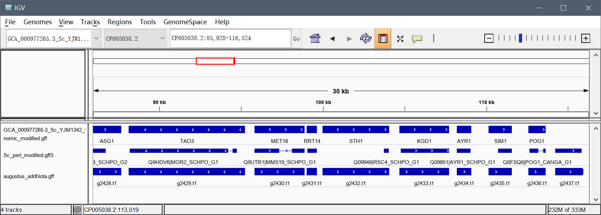
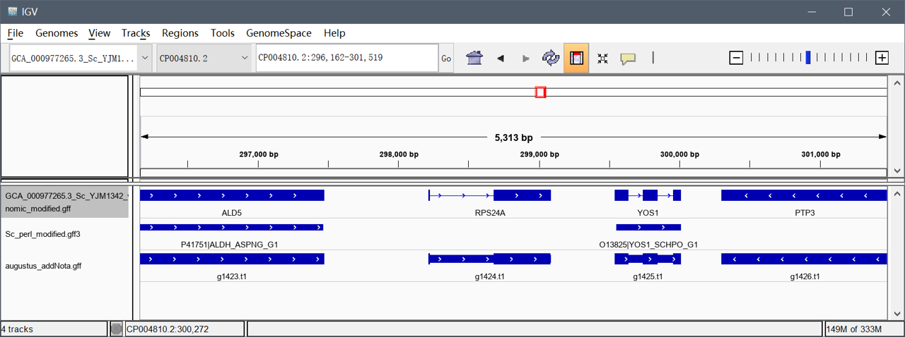

## 一、实验目的

1. 加深全基因组注释信息可视化意义的理解
2. 熟悉和掌握常用可视化工具的使用
3. 加强自主学习能力
4. 加深统计学在基因组数据分析中的应用
5. 培养发现问题、分析问题和解决问题的能力

## 二、实验内容

### 1. 基因组测序可视化工具相关文献资料的调研

> 通过检索公共搜索引擎或专业数据库（PubMed），查阅1种基因组可视化工具或实例，并对其功能特征进行描述

#### 1.1 Search in `Pubmed`

keyword:

```keyword
Genom* Browser[tiab]
Genom* View* [tiab]
```

#### 1.2 `USCS Genome Browser`

> Karolchik D, Hinrichs AS, Kent WJ. The UCSC Genome Browser. Current protocols in bioinformatics / editoral board, Andreas D Baxevanis [et al]. 2009;Chapter 1:Unit1 4. Epub 2009/12/04. 10.1002/0471250953.bi0104s28 PubMed Central PMCID: PMC2834533.

1. 由加利福尼亚大学圣克鲁斯分校（UCSC）开发的基因组浏览器(genome.ucsc.edu)
2. 可以快速显示任意比例的基因组的所需部分，并附带一系列对齐的注释“轨迹”。
3. 由UCSC基因组生物信息学小组和外部合作者生成的注释显示了基因预测，mRNA和表达的序列标签比对，简单的核苷酸多态性，表达和调控数据，表型和变异数据以及成对和多物种比较基因组学数据。
4. 与一个区域有关的所有信息都显示在一个窗口中，以方便进行生物学分析和解释。
5. 可以使用另一个基于Web的应用程序UCSC表浏览器查看，下载和操作Genome Browser轨道下面的数据库表。用户可以在两个浏览器中将数据作为自定义注释轨道上载，以供研究或教育用途。

### 2. 基因组可视化

> 利用其中任意一个可以本地化的工具对实验一所选物种基因组和搜有注释信息进行可视化；可视化成功后，任选一个包含注释信息的区间截图保存

#### 2.1 下载IGV


#### 2.2 进行基因组本地可视化

##### 2.2.1 导入基因组

```bash
# Genomes -> Lode Genome from file
GCA_000977265.3_Sc_YJM1342_v1_genomic.fna
```

##### 2.2.2 处理原GFF注释文件

由于`IGV`可视化时会将region区域连接，使得各个基因视图上组合在一起，不利于正确判断基因情况，因此需要对原GFF文件进行处理，删除掉region相关行。

```py
import pandas as pd

path = "GCA_000977265.3_Sc_YJM1342_v1_genomic.gff"
out = "GCA_000977265.3_Sc_YJM1342_v1_genomic_modified.gff"
dfrm = pd.read_csv(path, sep="\t", skiprows=7, header=None)
dfrm[dfrm[2]!="region"].to_csv(out, sep="\t", index=False, header=False)
```

##### 2.2.3 导入GFF注释文件

```bash
# File -> Lode from file
GCA_000977265.3_Sc_YJM1342_v1_genomic_modified.gff
# 采用Perl代码转换来的同源预测(blast)结果的gff3文档
Sc_perl_modified.gff3
# 采用Augustus从头预测结果的gff文档
augustus_addNota.gff
```





可以看到，在基因座位上，与实验4总结的一致，从头预测结果比同源预测结果更为准确，能够更准确地预测基因位置；在多外显子结构上，同源预测与从头预测都能正确预测出部分多外显子结构，但是同源预测可能会产生一定错误预测结构,且从头预测结果更好。
