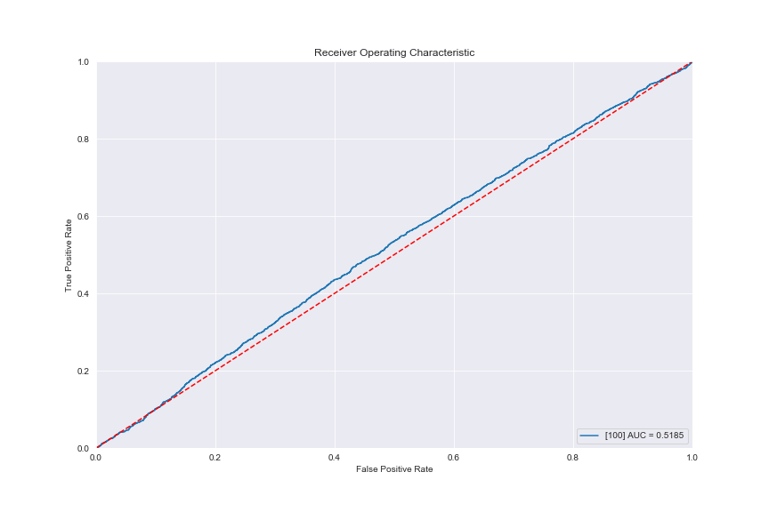

## 一、实验目的

1. 加深对基因启动子的理解和认知
2. 学会如何获取已知基因的启动子序列数据
3. 熟悉`EPD`和`TransFac`数据库的使用
4. 学会使用已知的启动子和转录因子TFBSs的HMM模型，并能够独立编程利用该HMM模型来计算鉴别未知启动子

## 二、实验内容

### 1. 数据准备

> 实验项目 1 中下载的基因组序列（FASTA 格式）、以及相应的 GFF 格式注释文件

```bash
workDir="/home/student/s24/zeFengZhu/Gen/"
fastaFile="$workDir/GCA_000977265.3_Sc_YJM1342_v1_genomic.fna"
gffFile="$workDir/GCA_000977265.3_Sc_YJM1342_v1_genomic.gff"
```

### 2. 启动子相关DNA元件HMM数据

#### 2.1 从`EPD`数据库中下载任意一种启动子相关的DNA元件的HMM数据

* [Link](<https://epd.epfl.ch/promoter_elements.php> "Link")
* Promoter element HMMs derived from EPD release 68 (September 2001): TATA-box HMM trained from 900 unrelated general promoter sequences

```py
WEIGHT = {
    "A": [61, 16, 352, 3, 354, 268, 360, 222, 155, 56, 83, 82, 82, 68, 77],
    "C": [145, 46, 0, 10, 0, 0,	3, 2, 44, 135, 147, 127, 118, 107, 101],
    "G": [152, 18, 2, 2, 5, 0, 20, 44, 157,150, 128, 128, 128, 139, 140],
    "T": [31,309, 35, 374, 30, 121, 6, 121, 33, 48, 31, 52,	61,	75,	71]
    }
```

可以看到，该权重矩阵中0值较少，针对性探究TATA-box的MOTIF的能力不是特别强。


### 3 DNA元件的计算鉴别

#### 3.1 根据该 HMM 数据，编写程序对上述基因组序列进行遍历，计算原始得分


```py
    # Part of my code
    @classmethod
    def seqIO(cls, path):
        name, seq = '', ''
        rows = cls.getFileRows(path)
        with open(path, 'rt') as seqFile:
            for index, line in enumerate(seqFile):
                if line.startswith(">"):
                    if index != 0:
                        yield name, seq
                        seq = ''
                    name = line[:-1]
                else:
                    seq += line[:-1].upper()
                    if index + 1 == rows:
                        yield name, seq

    def subSeq(self, str):
        for i in range(0, len(str)-self.length+1):
            yield i, str[i:i+self.length]
```

* 编写如上序列遍历函数
* `seqIO()`用以产出生成器，迭代产出单独一染色体的完整序列
* `subSet()`也产出生成器，迭代产出指定长度的滑动窗口子序列

```py
    # Part of my code
    def scoreSeq(self, seq, inb=False):
        score = 1
        for index, base in enumerate(seq):
            try:
                score *= self.weight[base][index]
            except KeyError:
                score = 0
                break
            except IndexError:
                print(seq, index, base)
                raise IndexError("Invalid length for inputed seq")

        if not inb:
            return score, self.bootstrapping(score, seq)
        else:
            return score
```

* 编写打分函数如上
* 对输入的序列遍历，访问权重矩阵哈希表(Python Dictionary)
* 如若遇到ATCG以外字符，则打分即为0。

#### 3.2 在计算分值的同时，使用 bootstrap 抽样评估的方法对计算每个片段可靠性p值

> 每随机打乱（shuffle）一次当前片段，就计算一个分值，并与原始得分进行比较

```py
from time import perf_counter
from collections import Counter
from scipy.special import comb
from numpy.random import shuffle
...
    # Part of my code
    def bootstrapping(self, score, seq):
        if score == 0:
            return None
        elif len(set(seq)) == 1:
            return 0
        else:
            pass

        recordDict = {}
        start = perf_counter()

        seq_len = len(seq)
        m = seq_len
        record, allPosNum = Counter(seq), 1
        for x in record.values():
            allPosNum *= comb(m, x)
            m -= x

        testNum = min(self.bootstrapNum, allPosNum)

        try:
            while len(recordDict) < testNum:
                seq_var = list(seq)
                self.seq = seq
                shuffle(seq_var)
                seq_var = ''.join(seq_var)
                if seq_var in recordDict.keys():
                    self.checkRunTime(start)
                    continue

                recordDict[seq_var] = self.scoreSeq(seq_var, inb=True)
                self.checkRunTime(start)
        except RuntimeError:
            print("skip")
            pass

        count = 0
        for varScore in record.values():
            if varScore > score:
                count += 1

        return count/testNum
```

* 编写如上bootstrapping函数
* 不计算分值为0的序列，返回`None`
* 本函数会针对输入序列计算其所有的打乱后的排序的数目(allPosNum)
  * 若该数目大于指定的bootstrapping次数(bootstrapNum)，则进行指定bootstrapNum次数的shuffle去计算并得出p-value
  * 若该数目小于指定的bootstrapNum，则最多进行allPosNum次数的shuffle，但此时的p-value已经失去意义，因此指定的bootstrapNum不能过大
* 每随机打乱(shuffle)一次当前片段，就计算一个分值，并与原始得分进行比较
* p值计算方法: 假设抽样评估总次数为N，每次评估的片段得分大于原始得分的次数为n, 则 p=n/N

#### 3.3 根据 p 值大小进行过滤

> 筛选阈值至少为 0.05，保留 p 值低于阈值的片段得分、p 值、基因组位置、正负链等信息

```py
import pandas as pd
...

    @staticmethod
    def filteringResult(pV, dict):
        return {chro: [(locus, score, pValue) for locus, score, pValue in value if pValue <= pV] for chro, value in dict.items()}

    def toDataFrame(self, dict, strand='+'):
        """convert the dict to a dataframe"""
        dfLyst = []
        allCols = ['seqid', 'source', 'type', 'start', 'end', 'score', 'strand', 'phase', 'pValue']
        for chro, data in dict.items():
            df = pd.DataFrame(data, columns=["start", "score", "pValue"])
            # df['attributes'] = df['pValue'].apply(lambda x: 'p-value={}'.format(x))
            df["seqid"] = ' '.join(chro[1:].split(' ')[0:1])
            df["strand"] = strand
            df["end"] = df["start"]+self.length-1
            for col in allCols:
                if col not in df.columns:
                    df[col] = '.'
            dfLyst.append(df)
        return pd.concat(dfLyst)[allCols]
```

* 该函数根据指定的p-value进行过滤

### 4. 把分析结果与基因组的注释信息进行对比

> 分析这些预测结果与已知基因的位置关系，找到每一个元件下游最邻近的基因转录起始位点，注意正负链的区


#### 4.1 运行3中编写的代码，得到分析结果

```bash
# -b: --bootstrapNum; -p: --pValue; -c: --chroNum; -r: --reverse
python PromoterHMM.py -f $fastaFile -b 50 -p 0.05 -c 16 -o ./ -r True
```

bootstrapNum取50次，已经测试过10次，20次，50次的pValue分布更可靠。(?)

得到文件:

```bash
output_50.gff3 # 正链
output_reverse_50.gff3 # 负链
```

#### 4.2 编写代码进行位点可视化

代码为附件中的`AnalysisResult.py`，同时负责可视化。

```bash
python AnalysisResult.py -i output_50.gff3,output_reverse_50.gff3 -r $gffFile -o ./ -s +-
```

对输出的分值进行可视化，横轴为位点，纵轴为分值。囿于基因位点以及分值位点较多，即便展示与最近基因的距离，也无法正确判断，因此下图暂不表征与基因的距离，下面的分析将会提及。

##### 正链


##### 负链


##### 预测元件数与基因数的统计

|染色体|正负链|预测元件数*|基因数|
|---|---|---|---|
|all|+|12045|3048|
|all|-|12166|3849|
CP005447.2| + |884|242
CP004647.2| + |726|189
CP005038.2| + |358|97
CP005346.2| + |673|165
CP006294.2| + |354|70
CP004945.1| + |272|56
CP005643.1| + |1124|271
CP004465.2| + |180|44
CP005249.1| + |1072|283
CP005151.2| + |658|175
CP006398.1| + |1552|323
CP006082.2| + |601|132
CP004810.2| + |520|148
CP005549.2| + |675|205
CP006174.2| + |869|241
CP004715.2| + |152|367

* *(pValue<0.05)

#### 4.3 HMM分类器效果评估

##### 来自YJM1342的gff文档


下图ROC来自`AnalysisResult.py`运行结果。图为设定一个距离阈值100bp的+-链联合分类结果，与对应链以及对应染色体的exon的start位点上游距离处于阈值以内的设定为阳性，以外的为阴性；然后以该元件的分值来绘制ROC曲线。




可以看到总体ROC并不出色，AUC仅0.51，说明此次HMM分类器在该100bp阈值条件下是弱分类器。

##### 进一步探究

分类效果并不理想，猜测可能是100bp的阈值条件设置有所影响，因此下面探究最佳阈值条件设置。

对每个预测元件计算其下游的最近gene start位点(对应链、对应染色体)与之的距离，取最近的进行统计，分布图如下：


可以看到距离分布主要集中在1000bp以内，同时部分染色体的预测结果不少特别理想，预测元件距离基因太远,再查看1000bp内的分布如下:


由此图来看，目前还无法判断最佳阈值，因此对多个阈值进行测试，绘制ROC，计算AUC，判断合适阈值：


尽管在1000bp内以5bp为步长，测试了多个阈值，得出200以内才有大于0.52的阈值，但是AUC仍无明显高值。

究其原因便是score打分无法精确将阳性与阴性数据区分开来，相当于随机选择。追根溯源便是本实验采用的HMM矩阵无法正确区分出启动子，YJM1342的启动子元件与HMM结果矩阵的TATA训练集不吻合，且从矩阵的各个碱基分值来看，其中0值以及较低值的参数较少，分值普遍较高，这就导致了大量假阳性的预测元件；同时假阳性元件中还存在较高分值。下图为阈值取10bp的阳性阴性分值分布图。


最终采取阈值为10bp，根据ROC得到的最佳score阈值为0.009687(log值为-4.637)

#### 4.4 根据上一步计算的阈值，对第3步的结果进行进一步的筛选，并按照 GFF3 格式保存

```py
df[(df["pValue"]<=0.05) & (df['score']>=0.009687)].to_csv("output_50_TATA_selected.gff3", sep="\t", index=False, header=False)
df_reverse[(df_reverse["pValue"]<=0.05) & (df_reverse['score']>=0.009687)].to_csv("output_reverse_50_TATA_selected.gff3", sep="\t", index=False, header=False)
```

