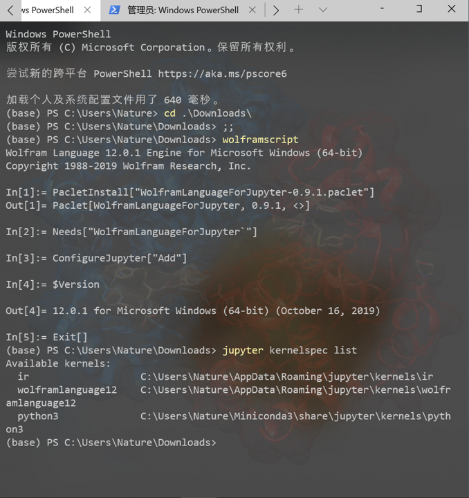
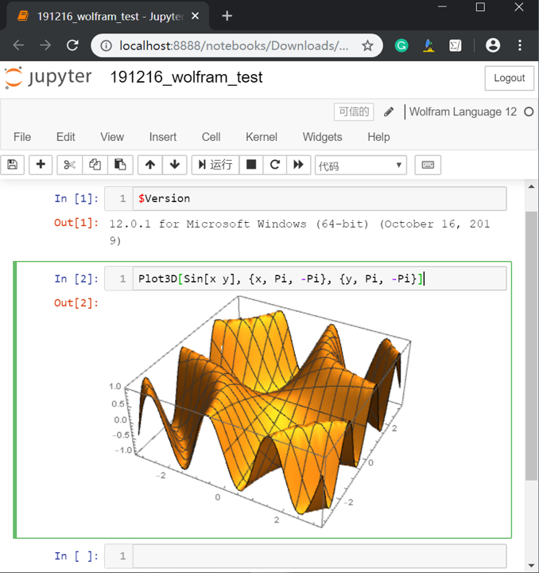
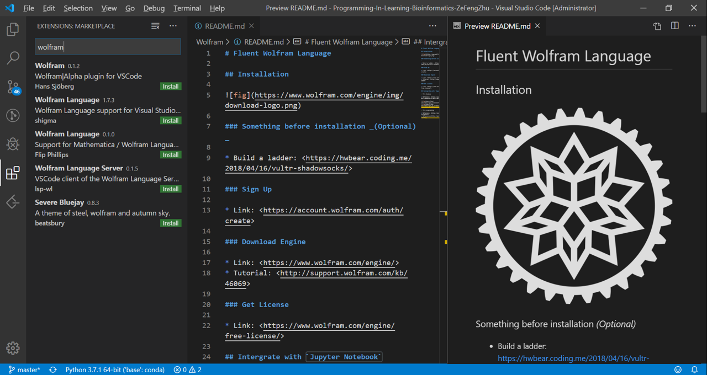

# Fluent Wolfram Language

## Installation

### Something before installation _(Optional)_

* Build a ladder: <https://hwbear.coding.me/2018/04/16/vultr-shadowsocks/>

### Sign Up

* Link: <https://account.wolfram.com/auth/create>

### Download Engine

* Link: <https://www.wolfram.com/engine/>
* Tutorial: <http://support.wolfram.com/kb/46069>

### Get License

* Link: <https://www.wolfram.com/engine/free-license/>

## Integrate with `Jupyter Notebook`

> for display

* Reference: <https://github.com/WolframResearch/WolframLanguageForJupyter>

## Integrate with `VS Code`

> for programming

* Reference: <https://github.com/Shigma/vscode-wl>
* Reference：<https://github.com/kenkangxgwe/lsp-wl>

